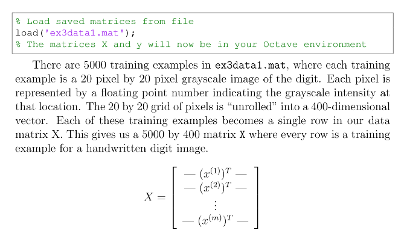

# Coursera - 機械学習コースの日本語訳

「Coursera（コーセラ）」のスタンフォード大学が提供する[機械学習コース](https://www.coursera.org/learn/machine-learning/)の日本語訳です。
Courseraは、スタンフォード大学コンピュータサイエンス教授Andrew Ng氏とDaphne Koller氏によって創立された教育技術の営利団体です。
世界中の多くの大学と協力し、それらの大学のコースのいくつかを無償でオンライン上に提供しています。

----

:warning: 誤訳を含んでいる可能性がありますので、意味が不明確な箇所は[原文](https://www.coursera.org/learn/machine-learning/)を読んでください。
誤訳の修正などに関するプルリクエストやイシュー登録をいただけると助かります。

----

## プログラミング演習

 1. [線形回帰](ex1.md)
 2. [ロジスティック回帰](ex2.md)
 3. [多クラス分類とニューラル・ネットワーク](ex3.md)
 4. [ニューラル・ネットワークの学習](ex4.md)
 5. [正則化された線形回帰とバイアス対分散](ex5.md)
 6. [サポート・ベクター・マシン](ex6.md)
 7. [K-meansクラスタリングと主成分分析](ex7.md)
 8. [異常検出とレコメンダー・システム](ex8.md)

## 翻訳のルール

日本翻訳連盟で公開されている[JTF日本語標準スタイルガイド（翻訳用）](https://www.jtf.jp/jp/style_guide/pdf/jtf_style_guide.pdf)に従います。

## 用語集

この演習で使用する機械学習関連の用語の日本語訳は、最も一般的と思われるもので統一しています。詳細は、[用語集](glossary.md)を確認してください。

## 記述形式

以下のように、ファイル名やプログラムの変数名などに対しては「\`」(バッククオート)を使用し、文章内の数式に対しては数式画像化サービス「[CodeCogs](https://www.codecogs.com/latex/eqneditor.php)」で変換したHTMLタグを利用しています。

----

 - 原文のPDFの例 
 
   
 
----

 - これをMarkdownで表現したもの

    ```
    % ファイルから保存された行列をロードする
    load('ex3data1.mat');
    % 行列XとYはOctave環境にロードされます
    ```
 
    `ex3data1.mat`には5000個のトレーニング・サンプルがあり、各トレーニング・サンプルは数字の20×20ピクセルのグレースケール画像です。
    各ピクセルは、その位置におけるグレースケール強度を示す浮動小数点数によって表されます。
    20×20グリッドのピクセルは、400次元のベクトルに「アンロール」されます。
    これらのトレーニング・サンプルは、それぞれデータ行列の1行になります。
    これは、5000×400の行列`X`を与え、各行は手書きの数字の画像のトレーニング・サンプルです。

    

----
    
文章内に「X」が2回出てきていますが、前者は数式、後者は変数名と判断して表現を変えています。また、ソースコードは「\`\`\`」で囲み、ソースコード内のコメントも日本語訳しています。実際に演習で使うスクリプト内のコメントも日本語に翻訳しています。文章内にない数式はPDFのキャプチャー画像を使用していますが、今後、数式画像化サービスで変換したHTMLタグに変える予定です。
