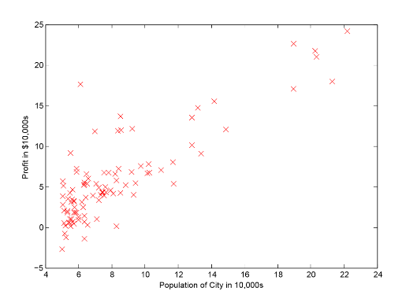
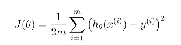
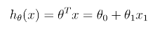
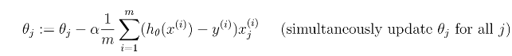
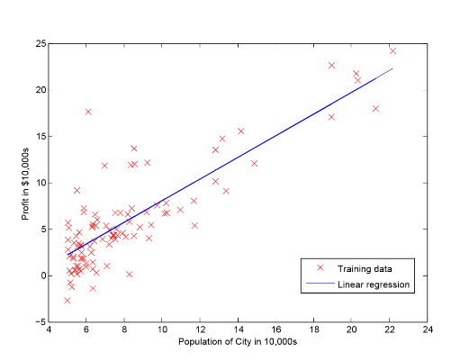
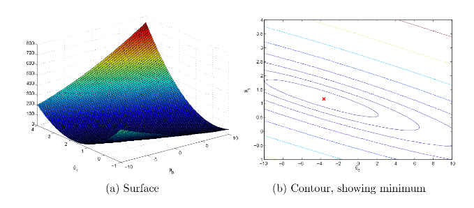
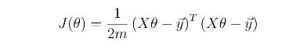
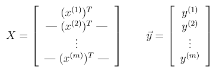
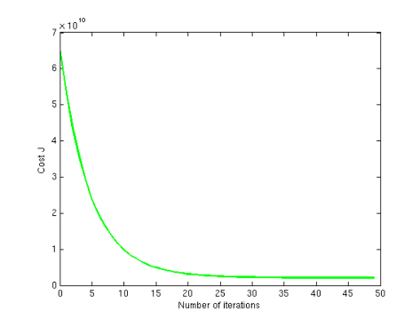
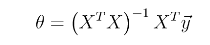

# プログラミング演習1: 線形回帰

機械学習

## はじめに

この演習では、線形回帰を実装し、それがデータに対して機能することを確認します。
プログラミング演習を始める前に、ビデオ講義を見て、関連トピックのレビュー質問を完了することを強くお勧めします。

演習を開始するには、スターターコードをダウンロードし、演習を終了するディレクトリーにその内容を解凍する必要があります。
必要に応じて、この演習を開始する前にOctave/MATLABの`cd`コマンドを使用してこのディレクトリーに移動してください。

また、コースウェブサイトの「環境設定手順」にOctave/MATLABをインストールするための手順も記載されています。

## この演習に含まれるファイル

 - `ex1.m` - 演習の手順を示すOctave/MATLABスクリプト
 - `ex1_multi.m` - 演習の後半パートのOctave/MATLABスクリプト
 - `ex1data1.txt` - 1変数の線形回帰のデータセット
 - `ex1data2.txt` - 複数変数の線形回帰のデータセット
 - `submit.m` - 解答を我々のサーバーに送信するスクリプト
 - [\*] `warmUpExercise.m` - Octave/MATLABの簡単なサンプル関数
 - [\*] `plotData.m` - データセットを表示する関数
 - [\*] `computeCost.m` - 線形回帰のコストを計算する関数
 - [\*] `gradientDescent.m` - 最急降下法を実行する関数
 - [y] `computeCostMulti.m` - 複数変数のコスト関数
 - [y] `gradientDescentMulti.m` - 複数変数の最急降下法
 - [y] `featureNormalize.m` - フィーチャーを正規化する関数
 - [y] `normalEqn.m` - 正規方程式を計算する関数
 
\* はあなたが完了する必要があるものを示しています。
y はオプションの演習を示しています。

演習では、`ex1.m`と`ex1_multi.m`というスクリプトを使用します。
これらのスクリプトは、問題に対するデータセットをセットアップし、あなたが実装する関数を呼び出します。
こららのスクリプトを変更する必要はありません。
この課題の指示に従って、他のファイルの関数を変更することだけが求められています。

このプログラミング演習では、1つの変数の線形回帰を実装する、前半のパートを完了することだけが必須です。
後半のパートは、任意であり、複数の変数の線形回帰を扱います。

### 助けを得る場所

このコースの演習では、数値計算に適した高度なプログラミング言語であるOctave（※1）またはMATLABを使用します。
OctaveまたはMATLABがインストールされていない場合は、コースWebサイトのEnvironment Setup Instructionsのインストール手順を参照してください。

Octave/MATLABコマンドラインでは、`help`の後に関数名を入力すると、組み込み関数のドキュメントが表示されます。
たとえば、`help plot`はプロットのヘルプ情報を表示します。
Octave関数の詳細のドキュメントは、[Octaveのドキュメントページ](www.gnu.org/software/octave/doc/interpreter/)にあります。
MATLABのドキュメントは、[MATLABのドキュメントページ](http://jp.mathworks.com/help/matlab/?refresh=true)にあります。

また、オンライン・ディスカッションを使用して、他の学生との演習について話し合うことを強く推奨します。
しかし、他人が書いたソースコードを見たり、他の人とソースコードを共有したりしないでください。

※1：Octaveは、MATLABの無料の代替ソフトウェアです。
プログラミング演習は、OctaveとMATLABのどちらでも使用できます。

## 1. 簡単なOctave/MATLABの関数

`ex1.m`の最初のパートでは、Octave/MATLABの構文と宿題の提出プロセスを練習します。
`warmUpExercise.m`ファイルには、Octave/MATLAB関数のアウトラインがあります。
次のコードを入力して、5×5の単位行列を返すように変更します。

```
A = eye(5);
```

終了したら、`ex1.m`を実行します（正しいディレクトリーにいると仮定して、Octave/MATLABのプロンプトで`ex1`と入力してください）。
次のような出力が表示されます。

```
ans =

Diagonal Matrix

   1   0   0   0   0
   0   1   0   0   0
   0   0   1   0   0
   0   0   0   1   0
   0   0   0   0   1
```

`ex1.m`はいずれかのキーを押すまで一時停止し、割り当てられた次のパートのコードを実行します。
終了したい場合は、<kbd>Ctrl</kbd> + <kbd>C</kbd>を打つと実行中にプログラムが停止します。

### 1.1. 解答の提出

演習の1つのパートが完了したら、Octave/MATLABのコマンドラインで`submit`を入力することで、評価のための解答を提出できます。
送信スクリプトは、ログイン用の電子メールと送信トークンを要求し、送信するファイルを尋ねます。
Webページから課題のための提出トークンを取得することができます。

*ここで解答を提出する必要があります。*

解答は複数回提出することが許可されており、最高のスコアのみが評価されます。

## 2. 一変数による線形回帰

演習のこのパートでは、食品トラックの利益を予測するために、一変数による線形回帰を実装します。
あなたはレストラン・フランチャイズのCEO（最高経営責任者）であり、新しい店舗をオープンするための異なる都市を検討しているとします。
チェーンにはすでにさまざまな都市にトラックがあり、都市の利益と人口に関するデータがあります。

このデータを、次に拡大する都市を選択するために活用したいと考えています。

ファイル`ex1data1.txt`には、線形回帰問題のデータセットが含まれています。
最初の列は都市の人口であり、2番目の列はその都市の食品トラックの利益です。
利益のマイナス値は損失を示します。

`ex1.m`スクリプトは、このデータを読み込むようにすでに設定されています。

### 2.1. データのプロット

タスクを開始する前に、データを可視化して理解することはしばしば役に立ちます。
このデータセットでは、プロットする2つのプロパティー（利益と人口）しかないため、散布図を使用してデータを可視化できます
（あなたが実際に遭遇する他の多くの問題は、多次元であり、2Dプロット上にプロットすることはできません）。
`ex1.m`では、データファイルから読み込んだデータセットが変数`X`と`y`にロードされます。

```
data = load('ex1data1.txt'); % カンマ区切りのデータを読み込む
X = data(:, 1); y = data(:, 2);
m = length(y); % トレーニング・サンプルの数
```

次に、スクリプトは関数`plotData`を呼び出してデータの散布図を作成します。
あなたがすべきことは、`plotData.m`を完成させてプロットを描画することです。
ファイルを編集し、次のコードを書き込みます。

```
plot(x, y, 'rx', 'MarkerSize', 10); % データをプロットする
ylabel('Profit in $10,000s'); % y軸のラベルを設定する
xlabel('Population of City in 10,000s'); % x軸のラベルを設定する
```

ここで`ex1.m`の実行を続けると、最終的な結果は図1のようになり、同じ赤いマーカー「x」と軸ラベルが表示されます。
`plot`コマンドの詳細については、Octave/MATLABコマンドプロンプトで`help plot`と入力するか、`plot`の文書をオンラインで検索してください。
マーカーの「x」を赤色に変更するために、`rx`オプションとともに`plot`コマンドを使用しています（`plot(..,[your options here],..,'rx');`）。



&nbsp;&ensp;&nbsp;&ensp; 図1: トレーニング・データの散布図1

### 2.2. 最急降下法

このパートでは、最急降下法を使用して、線形回帰パラメーターをデータセットに適合させます。

#### 2.2.1. 方程式の更新

線形回帰の目的は、コスト関数を最小にすることです



ここで仮説は、線形モデルによって与えられる



です。モデルのパラメーターはの値であることを思い出してください。
コストを最小にするために調整する値です。
これを行う1つの方法は、バッチ最急降下法アルゴリズムを使用することです。
バッチ最急降下法では、各反復が更新を実行します。



最急降下法の各ステップでは、パラメーターは、最小コストを達成する最適値に近づきます。

----

**実装上の注意：**

各サンプルは、Octave/MATLABの行列`X`に行として格納しています。
切片項（）を考慮に入れるために、最初の列をXに追加し、それをすべて1に設定します。
これは、を単に別の「フィーチャー」として扱うことを可能にします。

----

#### 2.2.2. 実装

`ex1.m`では、線形回帰のためのデータをすでに設定しています。
次の行では、切片項に対応するためにデータに別の次元を追加します。
また、初期パラメーターを`0`に、学習率を`0.01`に初期化します。

```
X = [ones(m, 1), data(:,1)]; % 1の列をxに追加する
theta = zeros(2, 1); % フィッティング・パラメーターを初期化する
iterations = 1500;
alpha = 0.01;
```

#### 2.2.3. コストを計算する

コスト関数を最小にすることを学ぶために最急降下法を実行する際に、コストを計算して収束を監視すると便利です。
このセクションでは、を計算する関数を実装して、最急降下法の実装の収束を確認することができます。
次のタスクは、を計算する関数`computeCost.m`ファイル内のコードを完成させることです。
これを行うとき、変数`X`と`y`はスカラー値ではなく、列がトレーニング・セットのサンプルを表す行列であることに注意してください。
この機能を完了したら、`ex1.m`の次のステップでは、をゼロに初期化して`computeCost`を1回実行し、画面に表示されるコストを確認します。
コストは32.07となるはずです。

*ここで解答を提出する必要があります。*

#### 2.2.4. 最急降下法

次に、`gradientDescent.m`ファイルに最急降下法を実装します。
ループ構造がすでに書かれているので、その中にの更新処理を実装するだけで十分です。

プログラムを作成する際に、何を最適化しようとし、何を更新しようとしているのかを理解してください。
コストは`X`と`y`ではなく、ベクトルによってパラメーター化されることに注意してください。
つまり、ベクトルの値を変更することでの値を最小化し、Xまたはyを変更することはできません。
不明な場合は、この配布資料の方程式とビデオ講義を参照してください。

最急降下法が正しく機能しているかどうかを確認するには、の値を見て、それが各ステップで減少していることを確認します。
`gradientDescent.m`のスターターコードは、すべての反復で`computeCost`を呼び出し、コストを表示します。
最急降下法と`computeCost`を正しく実装したと仮定すると、の値は決して増加することはなく、アルゴリズムの最後で安定した値に収束するはずです。

終了後、`ex1.m`は最終的なパラメーターを使用して線形近似をプロットします。
結果は図2のようになります。

最終的なの値は、35,000人と70,000人の利益の予測にも使用されます。
予測を計算するための`ex1.m`内の以下の行は、明らかな総和やループ処理ではなく、行列乗算を使用するように注意してください。
これはOctave/MATLABのコードにおけるベクトル化の例です。

*ここで解答を提出する必要があります。*

```
predict1 = [1, 3.5] * theta;
predict2 = [1, 7] * theta;
```

### 2.3. デバッグ

最急降下法を実装する際に留意すべきことがいくつかあります。

 - Octave/MATLAB配列のインデックスは、0からではなく1から始まります。
`theta`というベクトル変数にとを格納している場合、値は`theta(1)`と`theta(2)`になります。
 - 実行時に多くのエラーが発生している場合は、行列操作を検査して、互換性のある次元の行列を加算したり、乗算していることを確認します。
`size`コマンドで変数のサイズを表示すると、デバッグに役立ちます。
 - デフォルトでは、Octave/MATLABは算術演算子を行列演算子として解釈します。
 これは、サイズの非互換性エラーの一般的な原因です。
 行列の乗算をしたくない場合は、これをOctave/MATLABに指定するために「.」表記法を追加する必要があります。
 たとえば、`A * B`は行列乗算を行い、`A .* B`は要素ごとの乗算を行います。



&nbsp;&ensp;&nbsp;&ensp; 図2: 線形回帰近似とトレーニング・データ

### 2.4. の可視化

コスト関数をよりよく理解するために、との2次元グリッドにコストをプロットしてみましょう。
この部分には何も新しいコードを書く必要はありませんが、すでに書いたコードがどのようにこれらの画像を作成しているのかを理解する必要があります。
`ex1.m`の次のステップでは、あなたが書いた`computeCost`関数を使って値のグリッド上でを計算するようにコードが設定されています。

```
% J_valsを0の行列で初期化する
J_vals = zeros(length(theta0_vals), length(theta1_vals));

% J_valsに値を設定する
for i = 1:length(theta0_vals)
    for j = 1:length(theta1_vals)
      t = [theta0_vals(i); theta1_vals(j)];
      J_vals(i,j) = computeCost(X, y, t);
    end
end
```

これらの行が実行されると、の値の2次元配列が得られます。
スクリプト`ex1.m`はこれらの値を使用して、surfコマンドおよびcontourコマンドで、のサーフェスおよび等高線のプロットを作成します。
プロットは図3のようになります。



&nbsp;&ensp;&nbsp;&ensp; 図3: コスト関数

これらのグラフの目的は、がとの変化によってどのように変化するかを示すことです。
コスト関数は椀型であり、グローバル最小値を有します。
（これに関しては、コンタープロットの方が3Dサーフェスプロットよりも見やすいです）。
この最小値はとの最適点であり、最急降下法の各ステップはこの点に近づきます。

## オプションの演習

上の資料を正常に完成した場合は、おめでとうございます！
これで線形回帰を理解し、それを自分のデータセットで使用できるようになりました。
このプログラミング演習の残りのパートでは、以下のオプションの演習を追加しました。
これらの演習問題は、あなたがこの教材をより深く理解するのに役立ちます。
可能であれば、教材を完成することをお勧めします。

## 3. 複数変数による線形回帰

このパートでは、住宅の価格を予測するために、複数の変数を使用した線形回帰を実装します。
あなたは自宅を売ろうとしていて、良い市場価格がいくらであるか知りたいとします。
これを行う1つの方法は、最近販売された住宅に関する情報を収集し、住宅価格のモデルを作ることです。
ファイル`ex1data2.txt`には、オレゴン州ポートランドの住宅価格のトレーニング・セットが含まれています。
最初の列は住宅の大きさ（平方フィート）、2列目は寝室の数、3列目は住宅の価格です。
`ex1_multi.m`スクリプトは、この演習を進めるのに役立つようにセットアップされています。

### 3.1. フィーチャーの正規化

`ex1_multi.m`スクリプトは、このデータセットからいくつかの値をロードして表示することから始まります。
値を見ると、住宅の大きさは寝室の数の約1000倍です。
フィーチャーの値の大きさが異なる場合、フィーチャー・スケーリングを最初に実行すると、最急降下法がより迅速に収束できます。

ここでの作業は、`featureNormalize.m`内のコードを

- 各フィーチャーの平均値をデータセットから減算する。
- 平均値を減算した後、それぞれの標準偏差でフィーチャーの値をさらにスケール（除算）する。

標準偏差は、特定のフィーチャーの値の範囲に、どれだけのばらつきがあるかを測定する方法です
（ほとんどのデータ点は平均の±2標準偏差内にあります）。 
これは値の範囲（max-min）を取る代わりに使用されます。
Octave/MATLABでは、標準偏差を計算するために`std`関数を使用することができます。
たとえば、`featureNormalize.m`内では、数量`X(:,1)`にはトレーニング・セットの（住宅の大きさ）のすべての値が含まれるため、`std(X(:,1))`は住宅の大きさの標準偏差を計算します。
`featureNormalize.m`が呼び出された時点で、に対応する1の列はまだ`X`に追加されていません（詳細は`ex1_multi.m`を参照してください）。

すべてのフィーチャーでこれを行うと、コードはあらゆるサイズのデータセット（任意の数のフィーチャー/サンプル）で動作するはずです。
行列`X`の各列は1つのフィーチャーに対応することに留意してください。

*ここで解答を提出する必要はありません。*

----

**実装上の注意：**

フィーチャーを正規化するときは、正規化に使用される値（平均値と計算に使用される標準偏差）を保存することが重要です。
モデルからパラメーターを学習した後、これまで見たことのない住宅の価格を予測したいことがよくあります。
新しいx値（リビングルームとベッドルーム数）が与えられた場合、まずトレーニング・セットから計算した平均と標準偏差を使ってxを正規化する必要があります。

----

### 3.2. 最急降下法

以前は、単変量回帰問題に対する最急降下法を実装しました。
唯一の違いは、行列`X`にもう1つのフィーチャーがあることです。
仮説関数とバッチ最急降下法の更新ルールは変更されません。
`computeCostMulti.m`と`gradientDescentMulti.m`のコードを完了して、複数の変数による線形回帰のコスト関数と最急降下法を実装する必要があります。
前のパート（一変数）のコードがすでに複数の変数をサポートしている場合は、ここでもそれを使用できます。
コードが任意の数のフィーチャーをサポートし、うまくベクトル化されていることを確認してください。
`size(X, 2)`を使用して、データセットに存在するフィーチャーの数を調べることができます。

*ここで解答を提出する必要はありません。*

----

**実装上の注意：**

多変数の場合、コスト関数は次のベクトル化された形式で記述することもできます。



ここで



ベクトル化されたバージョンは、Octave/MATLABのような数値計算ツールで作業しているときに効率的です。
行列操作のエキスパートであれば、2つの形式が同等であることを証明することができます。

----

#### 3.2.1. オプション（非評価）演習：学習率の選択

演習のこのパートでは、データセットの様々な学習率を試し、すぐに収束する学習率を見つけることができます。
学習率を変更するには、`ex1_multi.m`を変更し、学習率を設定する部分のコードを変更します。

`ex1_multi.m`の次の段階では、`gradientDescent.m`関数が呼び出され、選択された学習率で約50回繰り返して最急降下法が実行されます。
この関数は、ベクトルJのの値の履歴も返さなければなりません。
最後の反復の後、`ex1_multi.m`スクリプトは反復回数に対して`J`値をプロットします。
良い範囲で学習率を選択した場合、プロットは図4のようになります。
グラフが大きく異なる場合、特にの値が大きくなったり、ブローアップしたりする場合は、学習率を調整してやり直してください。
学習率の値を、前の値の約3倍の乗算ステップ（すなわち、0.3、0.1、0.03、0.01など）で、対数スケールで試行することを推奨します。
また、曲線の全体的な傾向を確認するために、実行している反復回数を調整することもできます。



&nbsp;&ensp;&nbsp;&ensp; 図4: 適切な学習率での最急降下法の収束

----

**実装上の注意：**

学習率が大きすぎると、が発散してブローアップすることがあり、コンピュータ計算には大きすぎる値になります。
このような状況では、Octave/MATLABは`NaN`を返す傾向があります。
`NaN`は「数ではない」の略で、-∞と+∞を含む定義されていない操作によって引き起こされることがよくあります。

----

----

#### Octave/MATLABのヒント:

異なる学習学習率が収束にどのように影響するかを比較するには、`J`を同じ図の複数の学習率でプロットすると便利です。
Octave/MATLABでは、プロット間の`hold on`コマンドで最急降下法を複数回実行することにより、これを実行できます。
具体的には、3つの異なるアルファ値を試し（もっと多くの値を試した方がいいですが）、`J1`、`J2`、`J3`にコストを格納した場合、次のコマンドを使用して同じ図にプロットできます。

```
plot(1:50, J1(1:50), ‘b’);
hold  on;
plot(1:50, J2(1:50), ‘r’);
plot(1:50, J3(1:50), ‘k’);
```

最後の引数 `'b'`、 `'r'`、 `'k'`はプロットの色を指定します。

----

学習率が変化するにつれて、収束曲線も変化することに注目してください。
学習率が低い場合、最急降下法が最適値に収束するまでに非常に時間がかかることが分かります。
逆に、学習率が高い場合、最急降下法は収束しないか、または逸脱する可能性があります。
あなたが見つけた最高の学習率を使って、`ex1_multi.m`スクリプトを実行して収束まで最急降下法を実行し、の最終値を見つけます。
次に、この値を使用して、1650平方フィートと3つの寝室を持つ住宅の価格を予測します。
後で値を使用して、正規方程式の実装をチェックします。
この予測をするときにフィーチャーを正規化することを忘れないでください！

*ここで解答を提出する必要はありません。*

### 3.3. 正規方程式

講義ビデオでは、線形回帰に対する閉形式解が
 

 
この式を使用すると、フィーチャー・スケーリングは不要で、1回の計算で正確な解を得ることができます。
最急降下法のような「収束までのループ」はありません。
上記の式を使用してを計算するには、`normalEqn.m`のコードを完成させます。
フィーチャーをスケールする必要はありませんが、切片項（）を持つためには、1の列を行列`X`に追加する必要があります。
`ex1.m`のコードは1の列を`X`に追加します。

*ここで解答を提出する必要はありません。*

オプション（非評価）演習：
今度は、この方法でを見つけたら、それを使って3つのベッドルームの1650平方フィートの住宅の価格予測を行います。
最急降下法（3.2.1項）のモデルフィットを使用して得た値と同じ予測価格を与えることが分かります。

## 提出と採点

この課題が完了したら、送信機能を使用して解答を我々のサーバーに送信してください。
以下は、この演習の各パートの得点の内訳です。

| パート | 提出するファイル | 点数　|
----|----|---- 
| ウォームアップ演習 | `warmUpExercise.m` | 10 点 |
| 1変数のコスト計算 | `computeCost.m` | 40 点 |
| 1変数の最急降下法 | `gradientDescent.m` | 50 点 |
| 合計点 |  | 100 点 |

オプションの演習

| パート | 提出するファイル | 点数　|
----|----|---- 
| フィーチャーの正規化 | `featureNormalize.m` | 0 点 |
| 複数変数のコストの計算 | `computeCostMulti.m` | 0 点 |
| 複数変数の最急降下法 | `gradientDescentMulti.m` | 0 点 |
| 正規方程式 | `normalEqn.m` | 0 点 |

解答を複数回提出することは許可されており、最高のスコアのみを考慮に入れます。
