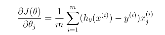

# プログラミング演習2: ロジスティック回帰

機械学習

## はじめに

この演習では、ロジスティック回帰を実装し、それを2つの異なるデータセットに適用します。
プログラミング演習を始める前に、ビデオ講義を見て、関連トピックのレビュー質問を完了することを強くお勧めします。

演習を開始するには、スターター・コードをダウンロードし、演習を終了するディレクトリーにその内容を解凍する必要があります。
必要に応じて、この演習を開始する前にOctave/MATLABの`cd`コマンドを使用してこのディレクトリーに移動してください。

また、コースウェブサイトの「環境設定手順」にOctave/MATLABをインストールするための手順も記載されています。

## この演習に含まれるファイル

 - `ex2.m` - 演習ex2を実行するOctave/MATLABスクリプト
 - `ex2_reg.m` - 演習の後半部分のOctave/MATLABスクリプト
 - `ex2data1.txt` - 演習の前半のトレーニング・セット
 - `ex2data2.txt` - 演習の後半のトレーニング・セット
 - `submit.m` - 解答を我々のサーバーに送信するスクリプト
 - `mapFeature.m` - 多項式フィーチャーを生成する関数
 - `plotDecisionBoundary.m` - 分類器の決定境界をプロットする関数
 - `plotData.m` - 2D分類データをプロットする関数
 - `sigmoid.m` - シグモイド関数
 - [\*] `costFunction.m` - ロジスティック回帰のコスト関数
 - [\*] `predict.m` - ロジスティック回帰の予測関数
 - [\*] `costFunctionReg.m` - 正則化されたロジスティック回帰のコスト
 
 \* はあなたが完了する必要があるものを示しています。

演習では、スクリプト`ex2.m`と`ex2_reg.m`を使用します。
これらのスクリプトは、問題に対するデータセットをセットアップし、あなたが実装する関数を呼び出します。
こららのスクリプトを変更する必要はありません。
この課題の指示に従って、他のファイルの関数を変更することだけが求められています。

### 助けを得る場所

このコースの演習では、数値計算に適した高度なプログラミング言語であるOctave（※1）またはMATLABを使用します。
OctaveまたはMATLABがインストールされていない場合は、コースWebサイトのEnvironment Setup Instructionsのインストール手順を参照してください。

Octave/MATLABコマンドラインでは、`help`の後に関数名を入力すると、組み込み関数のドキュメントが表示されます。
たとえば、`help plot`はプロットのヘルプ情報を表示します。
Octave関数の詳細のドキュメントは、[Octaveのドキュメントページ](www.gnu.org/software/octave/doc/interpreter/)にあります。
MATLABのドキュメントは、[MATLABのドキュメントページ](http://jp.mathworks.com/help/matlab/?refresh=true)にあります。

また、オンライン・ディスカッションを使用して、他の学生との演習について話し合うことを強く推奨します。
しかし、他人が書いたソースコードを見たり、他の人とソースコードを共有したりしないでください。

※1：Octaveは、MATLABの無料の代替ソフトウェアです。
プログラミング演習は、OctaveとMATLABのどちらでも使用できます。

## 1. ロジスティック回帰

この演習では、学生が大学に入学するかどうかを予測するロジスティック回帰モデルを作成します。

あなたは大学の部局の管理者であり、2つの試験の結果に基づいて各申請者の入学の可能性を判断したいとします。
以前の応募者の履歴データがあり、ロジスティック回帰のトレーニング・セットとして使用できます。
各トレーニングのサンプルでは、2つの試験の受験者の得点と入学の決定があります。

あなたがすべきことは、これらの2つの試験の得点に基づいて、申請者の入学確率を見積もる分類モデルを構築することです。
この概要と`ex2.m`のフレームワークコードが、演習をガイドします。

### 1.1. データの可視化

学習アルゴリズムの実装を開始する前に、可能であればデータを可視化することは常に有益です。
`ex2.m`の最初のパートのコードは、データをロードし、関数`plotData`を呼び出すことにより2次元プロット上にそれを表示します。
`plotData`でコードを完成させると、図1のような図が表示されます。
ここで、軸は2つの試験のスコアで、正と負のサンプルは異なるマーカーで示されています。


&nbsp;&ensp;&nbsp;&ensp; 図1：トレーニング・データの散布図

作図にもっと慣れ親しむため、`plotData.m`を空のままにしているので、それをあなた自身で実装してみましょう。
ただし、これはオプション（非評価）の演習です。
我々は、あなたがそれをコピーしたり参照したりできるように、以下の実装も提供します。
サンプルをコピーする場合は、Octave/MATLABのドキュメントを参照して、それぞれのコマンドが何をしているのかを確認してください。

```
% 正と負のサンプルのインデックスを見つける
pos = find(y==1); neg = find(y == 0);

% サンプルをプロットする
plot(X(pos, 1), X(pos, 2), 'k+','LineWidth', 2, ...
'MarkerSize', 7);
plot(X(neg, 1), X(neg, 2), 'ko', 'MarkerFaceColor', 'y', ... 
'MarkerSize', 7);
```

### 1.2. 実装

#### 1.2.1. ウォームアップ演習：シグモイド関数

実際のコスト関数から始める前に、ロジスティック回帰の仮説が、以下のように定義されていることを思い出してください。


ここで関数はシグモイド関数です。
シグモイド関数は次のように定義されます。


あなたがすべき最初のステップは、この関数を`sigmoid.m`に実装して残りのプログラムから呼び出せるようにすることです。
終了したら、Octave/MATLABのコマンドラインで`sigmoid(x)`を呼び出して、いくつかの値をテストしてみてください。
`x`の正の大きな値の場合、シグモイドは`1`に近く、大きな負の値の場合、シグモイドは`0`に近くなければなりません。
`sigmoid(0)`を評価すると正確に`0.5`になります。
コードはベクトルと行列でも動作するはずです。
行列の場合、関数はすべての要素に対してシグモイド関数を実行する必要があります。

Octave/MATLABコマンドラインで`submit`と入力すると、評価のための解答を提出できます。
送信スクリプトは、ログイン用の電子メールと送信トークンを要求し、送信するファイルを尋ねます。
Webページから課題のための提出トークンを取得することができます。

*ここで解答を提出する必要があります。*

#### 1.2.2. コスト関数と勾配

ロジスティック回帰のコスト関数と勾配を実装します。
`costFunction.m`のコードを完成させて、コストと勾配を返します。

ロジスティック回帰におけるコスト関数は


です。コストの勾配はと同じ長さのベクトルであり、番目の要素（について）は以下のように定義されます。


 
この勾配は線形回帰の勾配と同じに見えますが、線形回帰とロジスティック回帰ではの定義が異なるため、実際には数式が異なることに注意してください。

終了すると、`ex2.m`はの初期パラメーターを使用して`costFunction`を呼び出します。
コストは約`0.693`です。

*ここで解答を提出する必要があります。*

#### 1.2.3. `fminunc`を使用した学習パラメーター

前の課題では、最急降下法を実装することによって、線形回帰モデルの最適なパラメーターを見つけました。
あなたはコスト関数を書いてその勾配を計算し、それに応じて最急降下法の手順を実施しました。
今回は、最急降下法の手順を実施する代わりに、`fminunc`というOctave/MATLABのビルトイン関数を使用します。

Octave/MATLABの`fminunc`は、制約のない関数の（※2）の最小値を求める最適化ソルバーです。
ロジスティック回帰の場合、コスト関数をパラメーターで最適化する必要があります。

具体的には、（`X`値と`y`値の）固定データセットが与えられた場合、`fminunc`を使用してロジスティック回帰のコスト関数の最適なパラメーターを求めます。
次の入力を`fminunc`に渡します：

 - 最適化しようとしているパラメーターの初期値。
 - トレーニング・セットと特定のが与えられたときに、データセット（`X`, `y`）のに対するロジスティック回帰のコストと勾配を計算する関数。

`ex2.m`では、正しい引数を指定して`fminunc`を呼び出すコードがすでに作成されています。

※2：最適化における制約は、パラメーターの制約が多いです。
たとえば、が取ることができる可能な値（たとえば、）を限定する制約などです。
ロジスティック回帰には、が実際の値をとることが許されているため、このような制約はありません。

```
% fminuncのオプションを設定する
options = optimset('GradObj', 'on', 'MaxIter', 400);

%  fminuncを実行して最適なthetaを取得する
%  この関数はthetaとcostを返します [theta, cost] = ...
fminunc(@(t)(costFunction(t, X, y)), initial theta, options);
```

このコードスニペットでは、最初に`fminunc`で使用するオプションを定義しました。
具体的には、`GradObj`オプションを`on`に設定します。
これは、関数がコストと勾配の両方を返すことを`fminunc`に通知します。
これにより、関数を最小化するときに`fminunc`が勾配を使用できるようになります。
さらに、`MaxIter`オプションを400に設定すると、`fminunc`は終了すまでに最大で400ステップを実行します。

最小化している実際の関数を指定するために、`@(t) ( costFunction(t, X, y) )`を使って関数を指定する「short-hand」を使用します。
これは、`costFunction`を呼び出す引数`t`の関数を作成します。
これにより、`fminunc`で使用する`costFunction`をラップすることができます。

`costFunction`を正しく完了すると、`fminunc`は正しい最適化パラメーターに収束し、コストとの最終値を返します。
`fminunc`を使用することで、ループを自分で書く必要はなく、最急降下法のように学習率を設定することもできます。
これはすべて`fminunc`によって行われるので、あなたがすべきことはコストと勾配を計算する関数を用意するだけです。

`fminunc`が完了すると、`ex2.m`はの最適パラメーターを使用して、関数`costFunction`を呼び出します。
コストは約`0.203`です。

この最終的なの値は、トレーニング・データの決定境界をプロットするために使用され、図2と同様の図になります。
`plotDecisionBoundary.m`のコードを見て、値を使って境界線をプロットする方法を調べることもお勧めします。

#### 1.2.4. ロジスティック回帰の評価

パラメーターを学習した後、モデルを使用して、特定の生徒が入学するかどうかを予測できます。
試験1の得点が45点、試験2の得点が85点の学生は、入学確率が0.776になると予想されます。
見つけたパラメーターの品質を評価する別の方法は、学習モデルがトレーニング・セットでどのくらいうまく予測されるかを確認することです。


&nbsp;&ensp;&nbsp;&ensp; 図2：決定境界を持つトレーニング・データ

このパートでは、`predict.m`でコードを完成させます。
予測関数は、データセットおよび学習されたパラメーター・ベクトルが与えられると、予測値`1`または`0`を生成します。
`predict.m`でコードを完成させたら、`ex2.m`スクリプトは、正しいサンプルのパーセンテージを計算することによって、分類器のトレーニング精度を報告します。

*ここで解答を提出する必要があります。*

## 2. 正則化されたロジスティック回帰

この演習では、製造工場のマイクロチップが品質保証（QA）に合格しているかどうかを予測するために、正則化されたロジスティック回帰を実装します。
QA中、各マイクロチップは、正しく機能していることを確認するために、さまざまなテストを行います。

あなたは工場の製品マネージャーであり、2つの異なるテストでいくつかのマイクロチップのテスト結果があるとします。
この2つのテストから、マイクロチップを受け入れるか拒否するかを決定したいと考えています。
決定を手助けするために、過去のマイクロチップに関するテスト結果のデータセットがあり、ロジスティック回帰モデルを構築することができます。
 
演習のこのパートを完了するには、別のスクリプト`ex2_reg.m`を使用します。

### 2.1. データの可視化

この演習の前半と同様に、`plotData`は図3のような図を生成するために使用されます。
ここで、軸は2つのテストスコアであり、正（、受け入れ）と負（、拒否）のサンプルは 異なるマーカーで示されています。


&nbsp;&ensp;&nbsp;&ensp; 図3：トレーニング・データのプロット

図3は、プロットを通る直線で、データセットを正負のサンプルに分けることができないことを示しています。
したがって、ロジスティック回帰が線形の決定境界を見つけることしかできないため、ロジスティック回帰の直接的な応用はこのデータセットではうまく機能しません。

### 2.2. フィーチャー・マッピング

データをよりよくフィットさせる方法の1つは、各データ点からより多くのフィーチャーを作成することです。
提供された関数`mapFeature.m`で、フィーチャーをとの6乗までのすべての多項式項にマップします。


このマッピングの結果、2つのフィーチャーのベクトル（2つのQAテストのスコア）が28次元のベクトルに変換されました。
このより高次元のフィーチャー・ベクトルで訓練されたロジスティック回帰分類器は、より複雑な決定境界を持ち、2次元プロットで描画されるときに非線形に見えます。
フィーチャー・マッピングを使用すると、より表現力豊かな分類器を作成できますが、オーバーフィットの影響を受けやすくなります。
演習の次の段階では、データに合わせて正則化されたロジスティック回帰を実装します。
また、正則化がどのようにオーバーフィットの問題に対処するのかを自分で確認します。

### 2.3. コスト関数と勾配

今度は、正則化したロジスティック回帰のコスト関数と勾配を計算するコードを実装します。
`costFunctionReg.m`のコードを完成させて、コストと勾配を返します。
ロジスティック回帰における正則化されたコスト関数は、


です。パラメーターを正則化しないでください。
Octave/MATLABでは、索引付けが1から始まることを思い出してください。
したがって、コード内の`theta(1)`パラメーター（に対応）を正則化すべきではありません。
コスト関数の勾配は、番目の要素が以下のように定義されるベクトルです。


完了したら、`ex2_reg.m`はの初期値（すべてゼロに初期化されている）を使って`costFunctionReg`関数を呼び出します。
コストは約`0.693`です。

*ここで解答を提出する必要があります。*

#### 2.3.1. `fminunc`を使用した学習パラメーター

前半と同様に、最適なパラメーターを知るために`fminunc`を使用します。
正則化されたロジスティック回帰（`costFunctionReg.m`）のコストと勾配を正しく完成していれば、`ex2_reg.m`の次の部分を実行して、`fminunc`を使いパラメーターを知ることができます。

### 2.4. 決定境界のプロット

この分類器によって学習されたモデルを可視化するのを助けるために、正のサンプルと負のサンプルを分ける（非線形）決定境界をプロットする関数`plotDecisionBoundary.m`を提供しました。
`plotDecisionBoundary.m`では、分類器の予測を均等な間隔のグリッドに配置して非線形決定境界をプロットし、次に予測がからに変化する等高線プロットを描きます。

パラメーターを学習した後、`ex2_reg.m`の次のステップは、図4と同様の決定境界をプロットします。

### 2.5. オプション（非格付け）演習

練習のこの部分では、正則化がオーバーフィッティングを防止する方法を理解するために、データセットのさまざまな正則化パラメーターを試すことになります。

を変えると、決定境界の変化に注目してください。
小さなでは、分類器がほぼすべてのトレーニング・サンプルを正しいものにしますが、非常に複雑な境界を描き、データにオーバーフィットすることが分かります（図5）。
これは良い決定境界ではありません。たとえば、の点が受け入れられる（）と予測します。
これは、トレーニング・セットに対して誤った決定と思われます。

が大きいほど、より単純な決定境界を示すプロットが表示され、正と負がかなり良好に分離されます。
しかし、に大きぎる値を設定すると、決定境界がデータにあまり追随しないため、適切なフィットを得ることができません。したがって、データにアンダーフィッティングします（図6）。

*これらのオプション（非評価）の演習問題の解答を提出する必要はありません。*


&nbsp;&ensp;&nbsp;&ensp; 図4：決定境界（）のトレーニング・データ


&nbsp;&ensp;&nbsp;&ensp; 図5：正則化なし（オーバーフィッティング）（）


&nbsp;&ensp;&nbsp;&ensp; 図6：過度の正則化（アンダーフィッティング）（）
 
## 提出と採点

この課題が完了したら、送信機能を使用して解答を我々のサーバーに送信してください。
以下は、この演習の各パートの得点の内訳です。

| パート | 提出するファイル | 点数　|
----|----|---- 
| シグモイド関数 | `sigmoid.m` | 5 点 |
| ロジスティック回帰のコストの計算 | `costFunction.m` | 30 点 |
| ロジスティック回帰の勾配 | `costFunction.m` | 30 点 |
| 予測機能 | `predict.m` | 5 点 |
| 正則化されたロジスティック回帰のコストの計算 | `costFunctionReg.m` | 15 点 |
| 正則化されたロジスティック回帰の勾配 | `costFunctionReg.m` | 15 点 |
| 合計点 |  | 100 点 |

解答を複数回提出することは許可されており、最高のスコアのみを考慮に入れます。
