# プログラミング演習3: 多クラス分類とニューラル・ネットワーク

機械学習

## はじめに

この演習では、手書きの数字を認識するために、一対全て（one-vs-all）のロジスティック回帰とニューラル・ネットワークを実装します。
プログラミング演習を始める前に、ビデオ講義を見て、関連トピックの復習の問題を完了することを強くお勧めします。

演習を開始するには、スターター・コードをダウンロードし、演習を終了するディレクトリーにその内容を解凍する必要があります。
必要に応じて、この演習を開始する前にOctave/MATLABの`cd`コマンドを使用してこのディレクトリーに移動してください。

また、コースウェブサイトの「環境設定手順」にOctave/MATLABをインストールするための手順も記載されています。

## この演習に含まれるファイル

 - `ex3.m` - パート1の手順を示すOctave/MATLABのスクリプト
 - `ex3_nn.m` - パート2の手順を示すOctave/MATLABのスクリプト
 - `ex3data1.mat` - 手書き数字のトレーニング・セット
 - `ex3weights.mat` - ニューラル・ネットワークの演習の初期ウェイト
 - `submit.m` - 解答を我々のサーバーに送信する送信スクリプト
 - `displayData.m` - データセットを可視化するための関数
 - `fmincg.m` - 最小化ルーチンの関数（fminuncと同様）
 - `sigmoid.m` - シグモイド関数
 - [*] `lrCostFunction.m` - ロジスティック回帰コスト関数
 - [*] `oneVsAll.m` - 一対全ての多クラス分類器をトレーニングする
 - [*] `predictOneVsAll.m` - 一対全ての多クラス分類器を使用して予測する
 - [*] `predict.m` - ニューラル・ネットワーク予測関数
 
 \* はあなたが完了する必要があるものを示しています

演習では、スクリプト`ex3.m`と`ex3_nn.m`を使用します。
これらのスクリプトは、問題に対するデータセットをセットアップし、あなたが実装する関数を呼び出します。
こららのスクリプトを変更する必要はありません。
この課題の指示に従って、他のファイルの関数を変更することだけが求められています。

### 助けを得る場所

このコースの演習では、数値計算に適した高度なプログラミング言語であるOctaveまたはMATLABを使用します。
OctaveまたはMATLABがインストールされていない場合は、コースWebサイトのEnvironment Setup Instructionsのインストール手順を参照してください。

Octave/MATLABコマンドラインでは、`help`の後に関数名を入力すると、組み込み関数のドキュメントが表示されます。
たとえば、`help plot`はプロットのヘルプ情報を表示します。
Octave関数の詳細は、Octaveのマニュアルページを参照してください。
MATLABのドキュメントは、MATLABのドキュメントページにあります。

また、オンライン・ディスカッションを使用して、他の学生との演習について話し合うことを強く推奨します。
しかし、他人が書いたソースコードを見たり、他の人とソースコードを共有したりしないでください。

※1：Octaveは、MATLABの無料の代替ソフトウェアです。
プログラミング演習は、OctaveとMATLABのどちらでも使用できます。

## 1. 多クラス分類

この演習では、ロジスティック回帰とニューラル・ネットワークを使用して、手書き数字（0～9）を認識します。
郵便封筒のZIPコード（郵便番号）を認識することから、銀行小切手に書かれた金額を認識することに至るまで、今日、手書きの自動認識が広く使用されています。
この演習では、学習した方法をこの分類タスクにどのように使用できるかを示します。

演習の最初のパートでは、以前のロジスティック回帰の実装を拡張し、それを一対全ての分類に適用します。

### 1.1. データセット

5000個の手書き数字のトレーニング・サンプルを含む`ex3data1.mat`のデータセットが与えられます（※2）。
.mat形式は、データがcsvファイルのようなテキスト（ASCII）形式ではなく、ネイティブのOctave/MATLAB行列形式で保存されたことを意味します。
これらの行列は、`load`コマンドを使用してプログラムに直接読み込むことができます。
ロード後、正しい次元と値の行列がプログラムのメモリに表示されます。
行列にはすでに名前が付けられているので、名前を割り当てる必要はありません。

```
% ファイルから保存された行列をロードする
load('ex3data1.mat');
% 行列XとYはOctave環境にロードされます
```

※2：これは、MNISTの手書き数字データセットのサブセットです(http://yann.lecun.com/exdb/mnist/)。

`ex3data1.mat`には5000個のトレーニング・サンプルがあり、各トレーニング・サンプルは数字の20×20ピクセルのグレースケール画像です。
各ピクセルは、その位置におけるグレースケール強度を示す浮動小数点数によって表されます。
20×20グリッドのピクセルは、400次元のベクトルに「アンロール」されます。
これらのトレーニング・サンプルは、それぞれデータ行列の1行になります。
これは、5000×400の行列`X`を与え、各行は手書きの数字の画像のトレーニング・サンプルです。

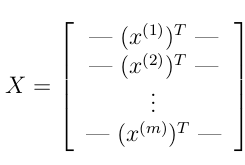

トレーニング・セットの2番目のパートは、トレーニング・セットのラベルを含む5000次元のベクトル`y`です。
ゼロインデックスがないOctave/MATLABインデックスとの互換性を高めるために、数字の0を10にマッピングしました。
したがって、数字の「0」は「10」とラベル付けされ、数字の「1」～「9」はそのままの順序で「1」～「9」とラベル付けされます。

### 1.2. データの可視化

トレーニング・セットのサブセットを可視化することから始めます。
`ex3.m`のパート1では、コードはXから100行をランダムに選択し、それらの行を`displayData`関数に渡します。
この関数は、各行を20ピクセル×20ピクセルのグレースケールイメージにマップし、イメージを一緒に表示します。
`displayData`関数を提供しました。コードがどのように動作するかを調べるためにコードを調べることをお勧めします。
この手順を実行すると、図1のような画像が表示されます。

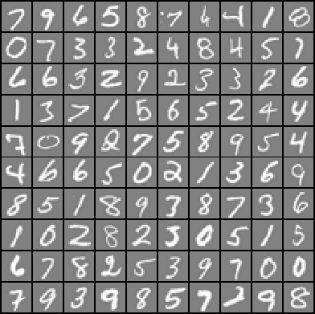

&nbsp;&ensp;&nbsp;&ensp; 図1: サンプルのデータセット

### 1.3. ロジスティック回帰のベクトル化

複数の一対全てのロジスティック回帰モデルを使用して、多クラスの分類器を構築します。
10のクラスがあるので、10の別々のロジスティック回帰分類器をトレーニングする必要があります。
このトレーニングを効率的に行うためには、コードが適切にベクトル化されていることを確認することが重要です。
このセクションでは、`for`ループを使用しないロジスティック回帰のベクトル化バージョンを実装します。
この演習の出発点としてここで実装したコードを、最後の演習で使用することができます。

#### 1.3.1. コスト関数をベクトル化する

コスト関数のベクトル化されたバージョンを書くことから始めます。
ロジスティック回帰のコスト（正則化なし）は、番目の要素が次のように定義されるベクトルであることを思い出してください。

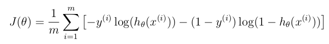

合計の各要素を計算するためには、すべてのサンプルについてを計算しなければなりません
（ここで、であり、はシグモイド関数です）。
行列の乗算を使用すると、すべてのサンプルに対してこれを迅速に計算できることが分かっています。
とを次のように定義します。

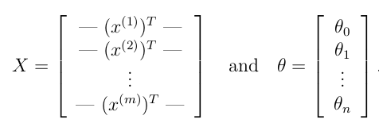

次に、行列積を計算することによって、

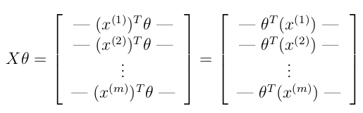

最後の等式では、とがベクトルの場合、という事実を使用しました。 
これにより、1行のコードですべてのサンプルに対する結果を計算することができます。 
あなたがすべきことは、非正則化コスト関数を`lrCostFunction.m`ファイルに書き込むことです。
実装では、上で示した戦略を使用してを計算する必要があります。 
残りのコスト関数についてもベクトル化手法を使用する必要があります。 
`lrCostFunction.m`の完全にベクトル化されたバージョンにはループが含まれていてはなりません。 
（ヒント：この関数を書くときは、要素ごとの乗算演算（`.*`）と合計演算`sum`を使用することができます）

#### 1.3.2. 勾配をベクトル化する

ロジスティック回帰コスト（非正則化）の勾配は、番目の要素が以下のように定義されるベクトルであることを思い出してください。

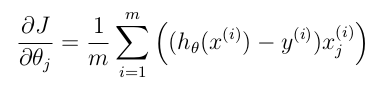

この操作をデータセットでベクトル化するには、すべてのに対してすべての偏微分を明示的に書き出し、

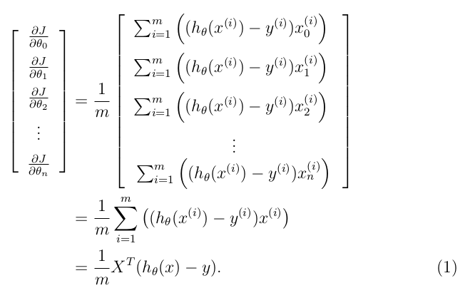

ここで、

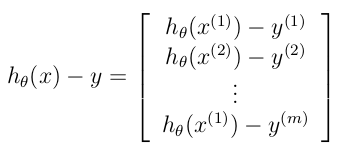

はベクトルであり、はスカラー（単一の数）であることに注意してください。
導出の最後のステップを理解するために、とし、以下を観察します。

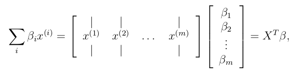

ここで、です。

上記の式は、ループなしですべての偏微分を計算することを可能にします。 
線形代数に慣れている場合は、ベクトル化されたバージョンが同じ計算を行うことを確かめるために、上記の行列乗算を行うことをお勧めします。
正しいベクトル化された勾配を計算するには、式1を実装する必要があります。
作業が完了したら、勾配を実装して`lrCostFunction.m`関数を完成させます。

----

#### デバッグのヒント: 

コードをベクトル化することは時々難しいことがあります。 
デバッグの一般的な戦略の1つは、`size`関数を使用して作業している行列のサイズを出力することです。
たとえば、サイズ100×20（100例、20フィーチャー）のデータ行列と（20×1次元のベクトル）を考えると、は有効な乗算演算であり、は有効ではありません。
さらに、ベクトル化されていないバージョンのコードを使用している場合は、ベクトル化コードと非ベクトル化コードの出力を比較して、同じ出力を生成することができます。

----

#### 1.3.3. 正則化されたロジスティック回帰をベクトル化する

ロジスティック回帰のベクトル化を実装したら、コスト関数に正則化を追加します。
正則化されたロジスティック回帰の場合、コスト関数は次のように定義されます。

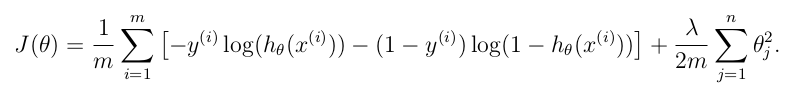

バイアス項に使用されるを正則化すべきではないことに注意してください。
これに対応して、の正則化されたロジスティック回帰コストの偏微分は次のように定義されます。

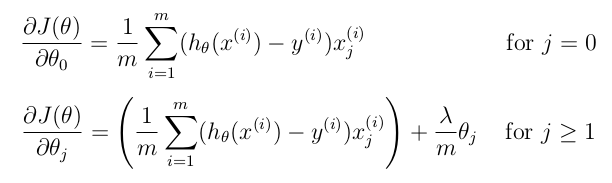

正則化を説明する`lrCostFunction`のコードを変更します。
もう一度言いますが、コードにループを入れないでください。

----

#### Octave/MATLABのヒント:

正則化されたロジスティック回帰のベクトル化を実装するときは、の特定の要素を合計して更新した方がいい場合があるかもしれません。
Octave/MATLABでは、行列にインデックスを付けて、特定の要素にのみアクセスして更新することができます。
たとえば、`A(:, 3:5) = B(:, 1:3)`は、`A`の3から5の列を`B`からの1から3の列に置き換えます。
インデックス付けで使用できる特別なキーワードの1つが、インデックス付けの`end`のキーワードです。
これにより、行列の終わりまで列（または行）を選択することができます。
たとえば、`A(:, 2:end)`は`A`の2番目の列から最後の列までの要素のみを返します。
したがって、これを`sum`および`.^`演算と共に使用して、関心のある要素のみの合計を計算することができます（たとえば、`sum(z(2:end).^2)`）。
スターター・コード`lrCostFunction.m`では、正則化された勾配を計算するさらに別の方法についてのヒントを提供しました。

----

*ここで解答を提出する必要があります。*

### 1.4. 一対全ての分類

この演習では、複数の正則化されたロジスティック回帰分類器をトレーニングすることで、一対全ての分類を実装します。
これは、データセットのクラスごとに1つです（図1）。
手書き数字のデータセットでは、ですが、あなたのコードは任意のの値に対して機能するはずです。
各クラスの1つの分類器をトレーニングするために、`oneVsAll.m`のコードを完成させる必要があります。
特に、コードはすべての分類器パラメーターを行列で返します。
ここで、の各行は1つのクラスのロジスティック回帰パラメーターに対応します。
あなたは1からまでの`for`ループでこれを行うことができ、それぞれの分類器を個別にトレーニングします。
この関数の引数は、1から10までのラベルのベクトルです（ここでは、インデックス付けの混乱を避けるために、ラベル10に数字「0」をマップしています）。
クラスの分類器をトレーニングするとき、ラベルのm次元ベクトルが必要です。
ここで、は、番目のトレーニング・インスタンスが（）に属するか、または異なるクラス（）に属するかを示します。この作業に役立つ論理的な配列があります。

----
#### Octave/MATLABのヒント:

Octave/MATLABの論理配列は、バイナリー（0または1）の要素を含む配列です。
Octave/MATLABでは、ベクトル`a`（サイズm×1）とスカラー`b`の式`a == b`を評価すると、`a`と同じサイズのベクトルが`a`の要素が`b`に等しい位置に1を返し、それらが異なるところではゼロになります。
これがどのように機能するかを確認するには、Octave/MATLABの次のコードを試してください：

```
a = 1:10; % aとbを作成する
b = 3;
a == b % ここでbの値を変えてみてください
```
----

さらに、`fminunc`ではなく、この演習で`fmincg`を使用します。
`fmincg`は`fminunc`と同様に機能しますが、多数のパラメーターを処理するときは、より効率的です。 
`oneVsAll.m`のコードを正しく入力すると、スクリプト`ex3.m`は`oneVsAll`関数を使用して多クラスのクラスターをトレーニングします。

*ここで解答を提出する必要があります。*

#### 1.4.1. 一対全ての予測

一対全ての分類器をトレーニングした後、これを使用して特定の画像に含まれる数字を予測できます。
入力ごとに、トレーニングされたロジスティック回帰分類器を使用して、各クラスに属する「確率」を計算する必要があります。
一対全ての予測関数は、対応するロジスティック回帰分類器が最も高い確率を出力するクラスを選択し、クラスラベル（または）を入力例の予測として返します。

これで、`predictOneVsAll.m`のコードを完成させ、一対全ての分類器を使用して予測を行う必要があります。

終了すると、`ex3.m`はの学習値を使って`predictOneVsAll`関数を呼び出します。
トレーニング・セットの精度は約`94.9`%です（つまり、トレーニング・セットのサンプルの`94.9`%が正しく分類されています）。

*ここで解答を提出する必要があります。*

## 2. ニューラル・ネットワーク

この演習の前半では、手書きの数字を認識するために多クラスのロジスティック回帰を実装しました。
しかし、ロジスティック回帰は線形分類器であるため、より複雑な仮説を形成することはできません（※3）。

演習のこのパートでは、前半パートと同じトレーニング・セットを使用して手書き数字を認識するためのニューラル・ネットワークを実装します。
ニューラル・ネットワークは、非線形の仮説を形成する複雑なモデルを表現することができます。
今週は、すでにトレーニングしたニューラル・ネットワークから取得したパラメーターを使用します。
あなたの目標は、予測のためにフィードフォワード・プロパゲーション（feedforward propagation）のアルゴリズムを実装して、ウェイトを使用することです。
次の例では、ニューラル・ネットワークのパラメーターを学習するためのバックプロパゲーション（backpropagation）のアルゴリズムを記述します。

提供されたスクリプト`ex3_nn.m`は、この演習を手助けします。

### 2.1. モデル表現

図2にニューラル・ネットワークを示します。
入力層、隠れ層、および出力層の3つの層があります。
入力は数字画像のピクセル値であることを思い出してください。
画像のサイズは20×20なので、これは400の入力層ユニットを与えます（常に+1を出力する追加のバイアスユニットを除く）。 
前述のように、トレーニング・データは変数`X`と`y`にロードされます。

すでにトレーニングされた一連のネットワーク・パラメーター（、）が提供されています。
これらは`ex3weights.mat`に格納され、`ex3_nn.m`によって`Theta1`と`Theta2`にロードされます。
パラメーターは、2番目のレイヤーに25個のユニットと10個の出力クラス（10桁のクラスに対応）を持つニューラル・ネットワーク用にサイズが決められています。

```
% ファイルから保存された行列をロードする
load('ex3weights.mat');
% Theta1とTheta2の行列がOctave環境に
% ロードされます
% Theta1のサイズは25 x 401です
% Theta2のサイズは10 x 26です
```

※3：ロジスティック回帰により多くのフィーチャー（多項式のフィーチャーなど）を追加できますが、トレーニングするのに非常にコストがかかることがあります。

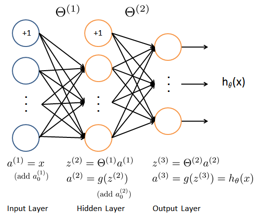

&nbsp;&ensp;&nbsp;&ensp; 図2: ニューラル・ネットワークモデル

### 2.2. フィードフォワード・プロパゲーションと予測


今度は、ニューラル・ネットワークのフィードフォワード・プロパゲーションを実装します。
ニューラル・ネットワークの予測を返すには、`predict.m`のコードを完了する必要があります。

すべてのサンプルについてを計算し、関連する予測を返す順計算を実装する必要があります。
一対全ての分類戦略と同様に、ニューラル・ネットワークからの予測は、最大の出力()を有するラベルとなります。

----
#### 実装上の注意: 

行列`X`は行内にサンプルを含んでいます。
`predict.m`でコードを完成させたら、1の列を行列に追加する必要があります。
行列`Theta1`と`Theta2`の行には、各ユニットのパラメーターが含まれています。
特に、`Theta1`の最初の行は、2番目の層の最初の隠れユニットに対応します。
Octave/MATLABでは、を計算するときに、列ベクトルとしてを得るように、`X`を正しく索引付けして（必要に応じて転置する）ことを確認してください。

----

完了したら、`ex3_nn.m`は`Theta1`と`Theta2`のロードされたパラメーターのセットを使用して予測関数を呼び出します。
精度が約`97.5`%であることが分かります。
その後、表示された画像に対して予測されたラベルをコンソールがプリントする間に、インタラクティブ・シーケンスがトレーニング・セットから一度に画像を表示します。
画像シーケンスを停止するには、<kbd>Ctrl</kbd> + <kbd>C</kbd>を押します。

*ここで解答を提出する必要があります。*

## 提出と採点

この課題が完了したら、送信機能を使用して解答を我々のサーバーに送信してください。
以下は、この演習の各パートの得点の内訳です。

| パート | 提出するファイル | 点数　|
----|----|---- 
| 正則化されたロジスティック回帰 | `lrCostFunction.m` | 30 点 |
| 一対全ての分類器のトレーニング | `oneVsAll.m` | 20 点 |
| 一対全ての分類器の予測 | `predictOneVsAll.m` | 20 点 |
| ニューラル・ネットワーク予測関数 | `predict.m` | 30 点 |
| 合計点 |  | 100 点 |

解答を複数回提出することは許可されており、最高のスコアのみを考慮に入れます。

