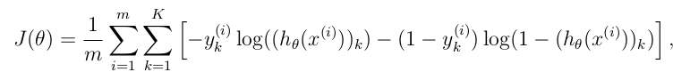
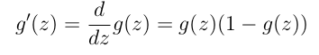
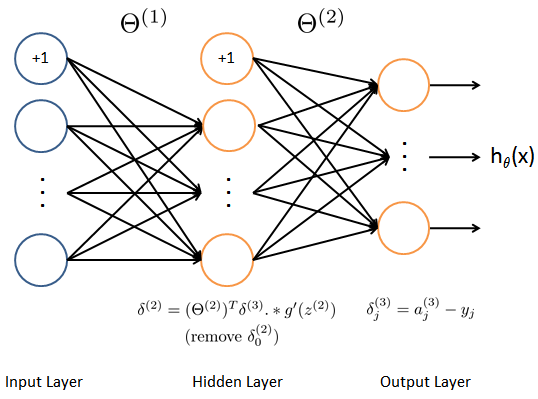

# プログラミング演習4: ニューラル・ネットワークの学習

機械学習

## はじめに

この演習では、手書きの数字を認識するために、一対全て（one-vs-all）のロジスティック回帰とニューラル・ネットワークを実装します。
プログラミング演習を始める前に、ビデオ講義を見て、関連トピックの復習の問題を完了することを強くお勧めします。

演習を開始するには、スターター・コードをダウンロードし、演習を終了するディレクトリーにその内容を解凍する必要があります。
必要に応じて、この演習を開始する前にOctave/MATLABのcdコマンドを使用してこのディレクトリーに移動してください。

また、コースウェブサイトの「環境設定手順」にOctave/MATLABをインストールするための手順も記載されています。

## この演習に含まれるファイル

 - ex4.m - 演習の手順を示すOctave/MATLABスクリプト
 - ex4data1.mat - 手書き数字のトレーニング・セット
 - ex4weights.mat - 演習4のニューラル・ネットワークパラメーター
 - submit.m - 解答を我々のサーバーに送信する送信スクリプト
 - displayData.m - データセットを可視化するための関数
 - fmincg.m - 最小化ルーチンの関数(fminuncと同様)
 - sigmoid.m - シグモイド関数
 - computeNumericalGradient.m - 数値的に勾配を計算する
 - checkNNGradients.m - 勾配の確認に役立つ機能
 - debugInitializeWeights.m - ウェイトを初期化する関数
 - predict.m - ニューラル・ネットワーク予測関数
 - [*] sigmoidGradient.m - シグモイド関数の勾配を計算する
 - [*] randInitializeWeights.m - ランダムにウェイトを初期化する
 - [*] nnCostFunction.m - ニューラル・ネットワークのコスト関数
 
 \* はあなたが完了する必要があるものを示しています

演習では、スクリプトex4.mを使用します。
このスクリプトは、問題に対するデータセットをセットアップし、あなたが実装する関数を呼び出します。
このスクリプトを変更する必要はありません。
この課題の指示に従って、他のファイルの関数を変更することだけが求められています。

### 助けを得る場所

このコースの演習では、数値計算に適した高度なプログラミング言語であるOctave（※1）またはMATLABを使用します。
OctaveまたはMATLABがインストールされていない場合は、コースWebサイトのEnvironment Setup Instructionsのインストール手順を参照してください。

Octave/MATLABコマンドラインでは、`help`の後に関数名を入力すると、組み込み関数のドキュメントが表示されます。
たとえば、`help plot`はプロットのヘルプ情報を表示します。
Octave関数の詳細のドキュメントは、[Octaveのドキュメントページ](www.gnu.org/software/octave/doc/interpreter/)にあります。
MATLABのドキュメントは、[MATLABのドキュメントページ](http://jp.mathworks.com/help/matlab/?refresh=true)にあります。

また、オンライン・ディスカッションを使用して、他の学生との演習について話し合うことを強く推奨します。
しかし、他人が書いたソースコードを見たり、他の人とソースコードを共有したりしないでください。

※1：Octaveは、MATLABの無料の代替ソフトウェアです。
プログラミング演習は、OctaveとMATLABのどちらでも使用できます。

## 1. ニューラル・ネットワーク

前回の演習では、ニューラル・ネットワーク用のフィードフォワード・プロパゲーションを実装し、手書き数字の予測のために、それを与えられたウェイトとともに使用しました。
この演習では、バックプロパゲーションのアルゴリズムを実装して、ニューラル・ネットワークのパラメーターを学習します。

提供されたスクリプトex4.mは、この演習を段階的に手助けします。

### 1.1. データの可視化

ex4.mの最初のパートでは、関数displayDataを呼び出すことによって、コードがデータをロードし、2次元プロット上（図1）に表示します。


&nbsp;&ensp;&nbsp;&ensp; 図1：データセットのサンプル

これは、前の演習で使用したのと同じデータセットです。
ex4data1.matには5000個のトレーニング・サンプルがあり、各トレーニング・サンプルは数字の20×20ピクセルのグレースケール画像です。
各ピクセルは、その位置におけるグレースケール強度を示す浮動小数点数によって表されます。
20×20グリッドのピクセルは、400次元のベクトルに「アンロール」(展開)されます。
これらのトレーニング・サンプルはそれぞれ、データ行列Xの1行になります。
これは5000×400の行列Xを与え、各行は手書きの数字の画像のトレーニング・サンプルです。


トレーニング・セットの第2のパートは、トレーニング・セットのラベルを含む5000次元のベクトルyです。
ゼロインデックスがないOctave/MATLABインデックスとの互換性を高めるために、数字の0を10にマッピングしました。
したがって、数字の「0」は「10」とラベル付けされ、数字の「1」〜「9」はそのままの順序で「1」〜「9」とラベル付けされます。

### 1.2. モデルの表現

この課題のニューラル・ネットワークを図2に示します。
3つの層（入力層、隠れ層および出力層）を有します。
入力は、数字の画像のピクセル値であることを思い出してください。
イメージのサイズは20×20であるため、入力層ユニットは400個となります（常に+1を出力する追加のバイアスユニットは数えません）。
トレーニング・データは、ex4.mスクリプトによって変数Xおよびyにロードされます。
すでにトレーニングされた一連のネットワークパラメーター(Θ(1),Θ(2))が提供されています。
これらはex4weights.matに格納され、ex4.mによってTheta1とTheta2にロードされます。
パラメーターは、第2層に25ユニット、出力ユニット10個（10桁のクラスに対応）のニューラル・ネットワーク用にサイズが決められています。

```
% ファイルから保存された行列をロードする
load('ex4weights.mat');
% The matrices Theta1 and Theta2 will now be in your workspace
% Theta1 has size 25 x 401
% Theta2 has size 10 x 26
```


&nbsp;&ensp;&nbsp;&ensp; 図2: ニューラル・ネットワークモデル

### 1.3. フィードフォワードおよびコスト関数

今度は、ニューラル・ネットワークのコスト関数と勾配を実装します。
まず、コストを返すためにnnCostFunction.mのコードを完成させます。
ニューラル・ネットワークのコスト関数（正則化なし）は、以下であることを思い出してください。



ここで、図2に示すようにが計算され、K = 10は可能なラベルの総数です。
なお、はk番目の出力単位のアクティベーション（出力値）です。
また、元のラベル（変数y内の）は1,2、...、10であるのに対して、ニューラル・ネットワークをトレーニングする目的で、
値0または1だけを含むベクトルとしてラベルを再コード化する必要があることを思い出してください。 
つまり、


たとえば、x(i)が数字5の画像である場合、対応する<a href="https://www.codecogs.com/eqnedit.php?latex=\inline&space;y^{(i)}" target="_blank"></a>（コスト関数とともに使用する必要があります）は、y5 = 1の10次元ベクトルであり、他の要素は全て0です。 
すべてのサンプルiに対してを計算し、コストを合計するフィードフォワード計算を実装する必要があります。
あなたのコードは、任意の数のラベルを持つ任意のサイズのデータセットに対しても機能するはずです
（少なくともK> = 3のラベルがあると仮定することができます）。

----

#### 実装上の注意：

行列Xの行にサンプルが含まれています（つまり、X(i,:)はi番目の学習サンプルx(i)で、n×1のベクトルとして表されます）。
nnCostFunction.mのコードを完成させるには、Xの行列に1の列を追加する必要があります。
ニューラル・ネットワークの各ユニットのパラメーターは、1行であるTheta1とTheta2で表されます。
特に、Theta1の1行目は、第2の層の第1の隠れユニットに対応します。
サンプルに対してforループを使用すると、コストを計算できます。

----

完了したら、ex4.mは、Theta1とTheta2のパラメーターのロードセットを使用してnnCostFunctionを呼び出します。
コストは約0.287629です。

*ここで解答を提出する必要があります。*

### 1.4. 正則化されたコスト関数

ニューラル・ネットワークの正則化されたコスト関数は、以下によって与えられます。


ニューラル・ネットワークは入力層、隠れ層、出力層の3つの層しか持たないと仮定できます。
しかし、あなたのコードは、任意の数の入力単位、隠し単位、および出力単位に対して機能するはずです。
明確にするために上記の指標をΘ(1)とΘ(2)に明示していますが、コードは一般にΘ(1)とΘ(2)の任意のサイズで機能するはずです。
バイアスに対応する項を正則化すべきではないことに注意してください。
Theta1とTheta2が行列の場合、これは各行列の最初の列に対応します。
これで、コスト関数に正則化を追加できたはずです。
まず、既存のnnCostFunction.mを使用して非正則化コスト関数Jを計算し、その後正則化項のコストを追加することができます。
完了したら、ex4.mは、Theta1とTheta2、およびのパラメーターのロードセットを使用してnnCostFunctionを呼び出します。
コストは約0.383770です。

## 2. バックプロパゲーション

この演習では、バックプロパゲーションのアルゴリズムを実装して、ニューラル・ネットワークのコスト関数の勾配を計算します。
gradに対して適切な値を返すように、nnCostFunction.mを完成する必要があります。
勾配を計算すると、fmincgなどの高度なオプティマイザを使用してコスト関数を最小化することによってニューラル・ネットワークをトレーニングすることができます。
最初にバックプロパゲーションのアルゴリズムを実装して、（正則化されていない）ニューラル・ネットワークのパラメーターの勾配を計算します。
正則化されていないケースの勾配の計算が正しいことを確認したら、正則化されたニューラル・ネットワークの勾配を実装します。

### 2.1. シグモイド勾配

演習のこのパートを始めるために、まずシグモイド勾配関数を実装します。シグモイド関数の勾配は、次のように計算できます。



ここで


完了したら、Octave/MATLABコマンドラインでsigmoidGradient(z)を呼び出して、いくつかの値をテストしてみてください。
zの大きな値（正と負の両方）の場合、勾配は0に近いはずです。
z = 0の場合、勾配は正確に0.25になるはずです。
あなたのコードはベクトルと行列でも動作するはずです。
行列の場合、あなたが作成した関数はすべての要素に対してシグモイド勾配関数を実行する必要があります。

*ここで解答を提出する必要があります。*

### 2.2. ランダム初期化

ニューラル・ネットワークをトレーニングする場合、対称性の破壊のためにパラメーターをランダムに初期化することが重要です。
ランダム初期化のための1つの効果的な方策は、Θ(l)の値を[-εinit, +εinit]にすることです。
εinit = 0.12を使うべきです（※2）。
この値の範囲は、パラメーターを小さく保ち、学習をより効率的にします。
あなたがすべきことは、randInitializeWeights.mを完成させての重みを初期化することです。
ファイルを変更し、次のコードを入力します。

```
% Randomly initialize the weights to small values
epsilon init = 0.12;
W = rand(L out, 1 + L in) * 2 * epsilon init ? epsilon init;
```

*ここで解答を提出する必要があります。*

※2：-εinitを選択するための1つの効果的な戦略は、ネットワークのユニット数を基にすることです。
εinitの良い選択は、εinit = √6 / √(Lin+Lout)であり、ここで、Lin = slであり、Lout = sl + 1は、Θ(l)に隣接する層の単位数に含まれます。

### 2.3. バックプロパゲーション



&nbsp;&ensp;&nbsp;&ensp; 図3: バックプロパゲーションの更新

では、バックプロパゲーションのアルゴリズムを実装しましょう。
バックプロパゲーションのアルゴリズムの背後にある直観は、以下の通りであることを思い出してください。
トレーニング・サンプル(x(t)、y(t))が与えられた場合、ネットワーク全体のすべてのアクティベーションを計算するために、まず「フォワードパス（forward pass）」を実行します
（仮説の出力を含んでいます）。
次に、レイヤーlの各ノードjに対して、エラー項δj(l)を計算します。
エラー項δj(l)は、出力におけるエラーについてノードがどれくらい責任を持っていたかを測定するものです。

出力ノードについては、ネットワークのアクティベーションと真の目標値の差を直接測定し、それを使ってδj(3)を定義することができます（レイヤー3は出力レイヤーなので）。
隠れユニットについては、レイヤー(l + 1)のノードの誤差項の加重平均に基づいてδj(l)を計算します。

詳細については、ここにバックプロパゲーションのアルゴリズムがあります（図3にも示されています）。
一度に1つのサンプルを処理するループ内に、手順1?4を実装する必要があります。
具体的には、t番目のトレーニング・サンプル(x(t)、y(t))の計算を実行するforループ(for t = 1:m)の中に、以下の手順1?4を実装します。
手順5は、累積された勾配をmで除算して、ニューラル・ネットワークのコスト関数の勾配を得ます。

1. 入力層の値(a(1))をt番目のトレーニング・サンプルx(t)に設定します。
フィードフォワードパスを実行し、レイヤー2とレイヤー3のアクティベーション(z(2)、a(2)、z(3)、a(3))を計算します。
レイヤーa(1)とレイヤーa(2)のアクティベーションのベクトルにもバイアスユニットが含まれていることを保証するために、+1の項を追加する必要があります。 
Octave/MATLABでは、a_1が列ベクトルの場合、1を加算するとa_1 = [1; a_1]です。

2. レイヤ3（出力レイヤ）の各出力ユニットkに対して、


ここで、yk∈{0,1}は、現在のトレーニング・サンプルがクラスk(yk = 1)に属するか、またはそれが異なるクラス(yk = 0)に属するかを示します。
このタスクに役立つ論理的な配列があります（前回のプログラミング演習で説明しました）。

3. 隠れ層l = 2については、次を設定します。


4. 次の式を使用して、このサンプルの勾配を累積します。 
δ0(2)をスキップまたは削除する必要があることに注意してください。
Octave/MATLABでは、δ0(2)を削除すると、delta_2 = delta_2(2：end)に相当します。


5. 累積された勾配を1/mで割ることにより、（規則化されていない）ニューラル・ネットワークのコスト関数の勾配を得ることができます。


----
#### Octave/MATLABのヒント:

バックプロパゲーションのアルゴリズムは、フィードフォワードおよびコスト関数を正常に完了した後にのみ実装する必要があります。
バックプロパゲーションのアルゴリズムを実装する際に、size関数を使用して、次元の不一致エラー（Octave/MATLABの「nonconformant arguments」エラー）が発生した場合は、作業している変数のサイズを出力すると便利です。

----

バックプロパゲーションのアルゴリズムを実装すると、スクリプトex4.mは、実装上の勾配チェックを実行します。
勾配チェックでは、コードが勾配を正しく計算しているという自信を高めることができます。

### 2.4. 勾配チェック

ニューラル・ネットワークで、コスト関数を最小にしています。
パラメーターの勾配チェックを実行するために、パラメーターΘ(1)、Θ(2)を長いベクトルに「アンロール」するとイメージできます。
そうすることで、コスト関数をと考えることができ、次の勾配チェックの手順を使用することができます。
 
意図的に∂/∂θi J(θ)を計算する関数fi(θ)があるとします。 
fiが正しい微分値を出力しているかどうかを確認します。


 
したがって、θ(i +)はと同じで、i番目の要素は?だけ増分されます。
同様に、θ(i-)は、i番目の要素が?だけ減少した対応するベクトルです。
各iについて、fi(θ)の正しさを次のように数値で検証することができます。


これらの2つの値が互いに近似する程度は、Jの詳細に依存します。
しかし、? = 10^-4と仮定すると、通常、上記の左右の辺は少なくとも4桁の有効数字に一致します(そして多くの場合、さらに多く)。
computeNumericalGradient.mの数値の勾配を計算する関数を実装しました。
ファイルを変更する必要はありませんが、どのように動作するかを理解するために、コードを確認してください。
ex4.mの次のステップでは、与えられた関数checkNNGradients.mを実行します。
この関数は、勾配のチェックに使用される小さなニューラル・ネットワークとデータセットを作成します。
バックプロパゲーションの実装が正しい場合は、1e-9より小さい相対的な差があるはずです。

----

#### 実際のヒント：

勾配チェックを実行する場合、比較的少数の入力ユニットと隠れユニットを持つ小さなニューラル・ネットワークを使用する方がはるかに効率的です。
の各次元はコスト関数の2つの評価を必要とし、これは高価になる可能性があります。
関数checkNNGradientsで、コードは小さなランダムなモデルとデータセットを作成します。
これは、勾配チェックのためにcomputeNumericalGradientで使用されます。
さらに、勾配計算が正しいことを確信したら、学習アルゴリズムを実行する前に勾配チェックをオフにする必要があります。

----

----

#### 実用的なヒント：

勾配チェックは、コストと勾配を計算しているすべての関数で機能します。
具体的には、同じcomputeNumericalGradient.m関数を使用して、他の演習の勾配の実装が正しいかどうかを確認することもできます
（ロジスティック回帰のコスト関数など）。

----

*コスト関数が（正則化されていない）ニューラル・ネットワークコスト関数の勾配チェックをパスしたら、ニューラル・ネットワーク勾配関数（バックプロパゲーション）を提出する必要があります。*

### 2.5. 正則化されたニューラル・ネットワーク

バックプロパゲーションのアルゴリズムを正常に実装したら、勾配に正則化を追加します。
正則化を説明するために、バックプロパゲーションを使用して勾配を計算した後で、これを追加項として追加することができます。
 
具体的には、バックプロパゲーションを使用してΔ(l)を計算した後、以下を使用して正則化を追加する必要があります。


バイアス項に使用されるΘ(l)の最初の列を正則化すべきではないことに注意してください。
さらに、パラメーターΘij(l)において、iは1からインデックスされ、jは0からインデックス付けされる。したがって、


多少混乱しますが、Octave/MATLABでのインデックス付けは1から始まります（iとjの両方で）。
したがって、Theta1(2,1)は実際にΘ20(l)に対応します（つまり、上記行列の第2行、第1列）。

今度は、正則化を考慮に入れて、nnCostFunctionのgradを計算するコードを修正してください。
完了後、ex4.mスクリプトは、実装の勾配チェックを実行します。
コードが正しければ、1e-9より小さい相対的な差異が見られるはずです。
 
*ここで解答を提出する必要があります。*

### 2.6. fmincgを使用した学習パラメーター

ニューラル・ネットワークのコスト関数と勾配の計算を正常に実装した後の、ex4.mスクリプトの次のステップでは、fmincgを使用して適切なパラメーターを学習します。

トレーニングが完了したら、ex4.mスクリプトは適切なサンプルの割合を計算することによって、分類器のトレーニング精度を報告します。
実装が正しい場合、報告されたトレーニングの精度は約95.3％です（これは、ランダム初期化のために約1％変化する可能性があります）。
より多くの反復でニューラル・ネットワークをトレーニングすることにより、より高いトレーニング精度を得ることが可能です。
繰り返し回数を増やす（たとえば、MaxIterを400に設定）ためにニューラル・ネットワークをトレーニングし、正規化パラメーターを変更することをお勧めします。
正しい学習設定では、ニューラル・ネットワークをトレーニング・セットに完全にフィットさせることができます。

### 3. 隠れ層の可視化

ニューラル・ネットワークが何を学習しているかを理解する方法の一つは、隠れたユニットによってどのような表現がキャプチャーされたかを可視化することです。
非公式に、特定の隠れユニットが与えられた場合、それが何を計算するかを可視化する1つの方法は、それが活性化する（すなわち、アクティベーション値iを1に近づける）入力xを見つけることです。
トレーニングしたニューラル・ネットワークでは、Θ(1)のi番目の行は、i番目の隠れユニットのパラメーターを表す401次元ベクトルです。
バイアス項を破棄すると、各入力ピクセルから隠れた単位までの重みを表す400次元のベクトルが得られます。

したがって、隠れユニットによって捕捉された「表現」を可視化する1つの方法は、この400次元ベクトルを20×20画像に再形成して表示することです（※3）。
ex4.mの次のステップでは、displayData関数を使用してこれを行い、25個のユニットを持つ画像（図4と同様）を表示します。
各ユニットは、ネットワーク内の1つの隠れユニットに対応しています。

トレーニングされたネットワークでは、隠れユニットは入力のストロークやその他のパターンを探す検出器に大まかに対応していることが分かります。


&nbsp;&ensp;&nbsp;&ensp; 図4：隠しユニットの可視化

※3：これは、入力に対して「ノルム」制約が与えられている（すなわち、kxk2≦1）と、隠れユニットに対して最も高いアクティベーションを与える入力を見つけることと等価であることが分かります。

### 3.1. オプションの（非評価）演習

この演習では、ニューラル・ネットワークのさまざまな学習設定を試して、正則化パラメーターとトレーニングステップ数（fmincgを使用する場合のMaxIterオプション）によってニューラル・ネットワークのパフォーマンスがどのように変化するかを確認します。

ニューラル・ネットワークは非常に複雑な決定境界を形成することができる非常に強力なモデルです。
正則化がなければ、ニューラル・ネットワークはトレーニング・セットを「オーバーフィット」する可能性があり、トレーニング・セットの100％に近い精度を得ることができますが、それまで見たことのない新しいサンプルには適合しません。
正則化を小さな値に、MaxIterパラメーターをより多くの反復回数に設定して、確認ができます。

学習パラメーターとMaxIterを変更すると、隠れユニットの可視化の変化を自分で確認することもできます。

*これらのオプション（非評価）の演習問題の解答を提出する必要はありません。*

## 提出と採点

この課題が完了したら、送信機能を使用して解答を我々のサーバーに送信してください。
以下は、この演習の各パートの得点の内訳です。

| パート | 提出するファイル | 点数　|
----|----|---- 
| フィードフォワードとコスト関数 | nnCostFunction.m | 30 点 |
| 正則化コスト関数 | nnCostFunction.m | 15 点 |
| シグモイド勾配 | sigmoidGradient.m | 5 点 |
| ニューラルネット勾配関数（バックプロパゲーション） | nnCostFunction.m | 40 点 |
| 正則化勾配 | nnCostFunction.m | 10 点 |
| 合計点 |  | 100 点 |

解答を複数回提出することは許可されており、最高のスコアのみを考慮に入れます。
