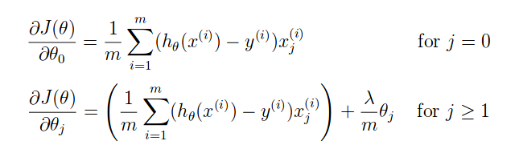
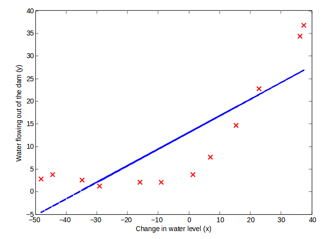
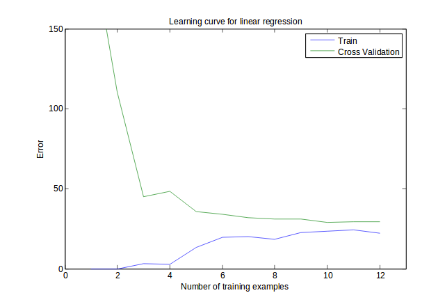

# プログラミング演習5: 正則化された線形回帰とバイアス対分散

機械学習

## はじめに

この演習では、正則化された線形回帰を実装し、これを使用してさまざまなバイアス・分散特性を持つモデルを学習します。
プログラミング演習を始める前に、ビデオ講義を見て、関連トピックのレビュー質問を完了することを強くお勧めします。

演習を開始するには、スターター・コードをダウンロードし、演習を終了するディレクトリーにその内容を解凍する必要があります。
必要に応じて、この演習を開始する前にOctave/MATLABのcdコマンドを使用してこのディレクトリーに移動してください。

また、コースウェブサイトの「環境設定手順」にOctave/MATLABをインストールするための手順も記載されています。

## この演習に含まれるファイル

 - ex5.m - 演習の手順を示すOctave/MATLABスクリプト
 - ex5data1.mat - データセット
 - submit.m - 解答を我々のサーバーに送信するスクリプト
 - featureNormalize.m - フィーチャー正規化関数
 - fmincg.m - 最小化ルーチンの関数（fminuncと同様）
 - plotFit.m - 多項式近似をプロットする
 - trainLinearReg.m - コスト関数を使用して線形回帰をトレーニングする
 - [\*] linearRegCostFunction.m - 正則化された線形回帰コスト関数
 - [\*] learningCurve.m - 学習曲線を生成する
 - [\*] polyFeatures.m - データを多項式フィーチャー空間にマップする
 - [\*] validationCurve.m - クロス・バリデーション曲線を生成する
 
 \* はあなたが完了する必要があるものを示しています

演習では、スクリプトex5.mを使用します。
これらのスクリプトは、問題に対するデータセットをセットアップし、あなたが実装する関数を呼び出します。
こららのスクリプトを変更する必要はありません。
この課題の指示に従って、他のファイルの関数を変更することだけが求められています。

### 助けを得る場所

このコースの演習では、数値計算に適した高度なプログラミング言語であるOctave（※1）またはMATLABを使用します。
OctaveまたはMATLABがインストールされていない場合は、コースWebサイトのEnvironment Setup Instructionsのインストール手順を参照してください。

Octave/MATLABコマンドラインでは、`help`の後に関数名を入力すると、組み込み関数のドキュメントが表示されます。
たとえば、`help plot`はプロットのヘルプ情報を表示します。
Octave関数の詳細のドキュメントは、[Octaveのドキュメントページ](www.gnu.org/software/octave/doc/interpreter/)にあります。
MATLABのドキュメントは、[MATLABのドキュメントページ](http://jp.mathworks.com/help/matlab/?refresh=true)にあります。

また、オンライン・ディスカッションを使用して、他の学生との演習について話し合うことを強く推奨します。
しかし、他人が書いたソースコードを見たり、他の人とソースコードを共有したりしないでください。

※1：Octaveは、MATLABの無料の代替ソフトウェアです。
プログラミング演習は、OctaveとMATLABのどちらでも使用できます。

## 1. 正則化された線形回帰

演習の前半では、貯水池の水位の変化を使ってダムから流出する水の量を予測するために、正則化された線形回帰を実装します。
後半では、デバッグ学習アルゴリズムのいくつかの診断を行い、バイアス対分散の影響を調べます。

提供されたスクリプトex5.mは、この演習を段階的に手助けします。

### 1.1. データセットの可視化

水位の変化(x)、ダムからの水の流出量(y)についての歴史的記録を含むデータセットを視覚化することから始めます。

このデータセットは3つのパートに分かれています。

 - モデルが学習するトレーニング・セット： X、y
 - 正則化パラメーターを決定するためのクロス・バリデーション・セット： Xval、yval
 - パフォーマンスを評価するためのテストセット。モデルがトレーニング中に参照しなかった「未参照」のサンプル： Xtest、ytest

ex5.mの次のステップでトレーニング・データをプロットします（図1）。
以降のパートで、線形回帰を実装し、それを使用してデータを直線にフィットさせ、学習曲線をプロットします。
それに続いて、多項式回帰を実装して、データにさらによくフィットするようにします。

&nbsp;&ensp;&nbsp;&ensp; 図1: サンプルデータセット1

### 1.2. 正則化された線形回帰のコスト関数

正則化された線形回帰は、以下のコスト関数となることを思い出してください。

ここで、は正則化の程度を制御する正則化パラメーターです（したがって、オーバーフィッティングを防ぐのに役立ちます）。
正則化項はコストJ全体にペナルティーを課します。
モデル・パラメーターの大きさが増加するにつれて、ペナルティーも増加します。
項は正則化しないでください（Octave/MATLABのインデックス付けが1から始まるので、Octave/MATLABでは項はtheta（1）として表されます）。

これで、ファイルlinearRegCostFunction.mのコードを完成させられるはずです。
あなたがすべきことは、正則化された線形回帰コスト関数を計算する関数を書くことです。
可能であれば、コードをベクトル化してループを作成しないようにしてください。
終了したら、ex5.mの次のパートは[1; 1]で初期化されたthetaを使用してコスト関数を実行します。
出力は303.993となるはずです。

*ここで解答を提出する必要があります。*

### 1.3. 正則化された線形回帰の勾配

これに対応して、正則化された線形回帰のに対するコストの偏微分は、以下のように定義されます。

linearRegCostFunction.mに、勾配を計算するためのコードを追加し、変数gradでそれを返します。
終了したら、ex5.mの次のパートは[1; 1]で初期化されたthetaを使って勾配関数を実行します。
あなたは[-15.30; 598.250]の勾配が確認できるはずです。

*ここで解答を提出する必要があります。*

### 1.4. 線形回帰のフィッティング

コスト関数と勾配が正しく機能したら、ex5.mの次のパートはtrainLinearReg.mのコードを実行しての最適値を計算します。
このトレーニング関数は、コスト関数を最適化するためにfmincgを使用します。

このパートでは、正則化パラメーターをゼロに設定します。
現行の線形回帰の実装は2次元のに適合しようとしていますが、このような低次元のでは正則化はあまり有用ではないからです。
演習の後半では、多項式回帰と正則化を使用します。

最後に、ex5.mスクリプトは、図2に類似した画像をもたらす最良適合線をプロットする必要があります。
最良適合線は、データが非線形パターンを持つため、モデルがデータに適していないことを示しています。
学習アルゴリズムをデバッグするには、示されているように最適なフィッティングを視覚化する方法がありますが、データとモデルを視覚化することは必ずしも容易ではありません。
次のセクションでは、データを視覚化することが容易でない場合でも、学習アルゴリズムをデバッグするのに役立つ学習曲線を生成する関数を実装します。

&nbsp;&ensp;&nbsp;&ensp; 図2: 線形近似

## 2. バイアス-分散

機械学習における重要な概念はバイアス-分散のトレードオフです。
バイアスが大きいモデルはデータに対して十分に複雑ではなくアンダーフィットする傾向がありますが、分散が大きいモデルはトレーニング・データにオーバーフィットします。

この演習では、トレーニングとテストの誤差を学習曲線にプロットし、バイアス・分散問題を診断します。

### 2.1. 学習曲線

では、学習アルゴリズムのデバッグに役立つ学習曲線を生成するコードを実装しましょう。
学習曲線は、トレーニング・セットのサイズの関数としてトレーニングとクロス・バリデーションの誤差をプロットすることを思い出してください。
あなたがすべきことは、learningCurve.mを実装し、トレーニング・セットとクロス・バリデーション・セットの誤差のベクトルを返すことです。

学習曲線をプロットするには、異なるトレーニング・セットのサイズに対して、トレーニング・セットとクロス・バリデーション・セットの誤差が必要です。
具体的には、トレーニング・セットのサイズがiの場合は、最初のi個のサンプル（つまり、X（1:i,:)とy（1:i））を使います。

trainLinearReg関数を使用してパラメーターを見つけることができます。
lambdaは、パラメーターとしてlearningCurve関数に渡されることに注意してください。
パラメーターを学習した後、トレーニング・セットとクロス・バリデーション・セットの誤差を計算する必要があります。
データセットのトレーニング誤差は次のように定義されることを思い出してください。

特に、トレーニング誤差には正則化項は含まれないことに注意してください。
トレーニング誤差を計算する方法の1つは、既存のコスト関数を使用して、トレーニング誤差とクロス・バリデーション誤差を計算するときにのみを0に設定することです。
トレーニング・セット誤差を計算するときは、（トレーニング・セット全体ではなく）トレーニングサブセット（つまり、X（1：n,:)およびy（1：n））で必ず計算してください。
ただし、クロス・バリデーション誤差の場合は、クロス・バリデーション・セット全体で計算する必要があります。
計算された誤差をベクトルerror_trainとerror_valに格納する必要があります。
終了したら、ex5.mは学習曲線を印刷し、図3と同様のプロットを作成します。

*ここで解答を提出する必要があります。*

図3では、トレーニング・サンプルが増えると、トレーニング誤差とクロス・バリデーション誤差の両方が高いことが分かります。
これは、モデルにおける高バイアス問題を反映しています。

&nbsp;&ensp;&nbsp;&ensp; 図3: 線形回帰学習曲線1

線形回帰モデルは、あまりにも単純で、我々のデータセットをうまく適合させることができません。
次のセクションでは、このデータセットに対してより良いモデルに合うように多項式回帰を実装します。

## 3　多項式回帰

我々の線形モデルの問題は、それがデータにとってはあまりにも単純であり、アンダーフィッティング（高バイアス）であるということでした。
演習のこのパートでは、より多くのフィーチャーを追加することでこの問題に対処します。
多項式回帰を使用するために、仮説は以下の形式となります。

x1 =（waterLevel）、x2 =（waterLevel）^2、...xp =（waterLevel）^pを定義することに注意してください。
フィーチャーが元の値（waterLevel）のさまざまな累乗である線形回帰モデルが得られます。

これで、データセット内の既存のフィーチャーxの高次の累乗を使うことで、より多くのフィーチャーを追加します。
このパートであなたがすべきことは、関数がm×1の元のトレーニング・セットXに、より高い乗数をマップするように、polyFeatures.mのコードを完成させることです。
具体的には、サイズm×1のトレーニング・セットXが関数に渡されるとき、関数はm×p行列のX_polyを返すべきです。
列1にはXの元の値が格納され、列2にはX.^2の値が格納され、列3にはX.^3の値が格納されます。
このフィーチャーで0乗を考慮する必要はありません。
今度はフィーチャーを高次元にマップする関数があり、ex5.mのパート6では、トレーニング・セット、テストセット、クロス・バリデーション・セット（まだ使用していない）に適用されます。

*ここで解答を提出する必要があります。*

### 3.1. 多項式回帰の学習

polyFeatures.mを完了すると、ex5.mスクリプトは線形回帰のコスト関数を使用して、多項式回帰をトレーニングします。

フィーチャーベクトルに多項式の項があるとしても、線形回帰の最適化の問題を解決しているということを覚えていてください。
多項式の項が、線形回帰に使用できるフィーチャーに変わっただけです。
この演習の前半で書いたのと同じコスト関数と勾配を使用しています。

演習のこのパートでは、8次の多項式を使用します。
予定されたデータに対して直接トレーニングを実行すると、フィーチャーがひどく縮小されてしまい、うまく機能しません
（例：x = 40では、フィーチャーx8 = 40^8 = 6.5×10^12になります）。
したがって、フィーチャーの正規化を使用する必要があります。

多項式回帰のパラメーターを学習する前に、ex5.mはfeatureNormalizeを呼び出し、トレーニング・セットのフィーチャーを正規化し、パラメーターmu、sigmaを別々に記憶します。
この機能はすでに実装されており、最初の演習と同じ機能です。
パラメーターを学習すると、の多項式回帰のために2つのプロット（図4,5）が生成されます。

図4から、多項式近似がデータポイントに非常によく追従できることが分かります。
したがって、トレーニング・誤差が低くなります。
しかし、多項式近似は非常に複雑であり、極端に低下もします。
これは、多項式回帰モデルがトレーニング・データを上回っており、一般化できないという指標です。
非正則化（）モデルの問題をよりよく理解するために、学習曲線（図5）は、低いトレーニング誤差が低く、クロス・バリデーション誤差が高い場合と同じ効果を示すことが分かります。
トレーニングとクロス・バリデーション誤差の間にはギャップがあり、分散の問題が高いことを示しています。

&nbsp;&ensp;&nbsp;&ensp; 図4: 多項式近似、

&nbsp;&ensp;&nbsp;&ensp; 図5: 多項式学習曲線、

オーバーフィット（高分散）問題に対処する1つの方法は、モデルに正則化を追加することです。
次のセクションでは、正則化がどのようにしてより良いモデルにつながるかを確認するために、さまざまなパラメーターを試してみましょう。

### 3.2. オプション（非評価）演習：正則化パラメーターの調整

このセクションでは、正則化パラメーターが正則化多項式回帰のバイアス分散にどのように影響するかを観察します。
ex5.mのlambdaパラメーターを変更して,100を試してみるべきです。
これらの値のそれぞれについて、スクリプトはデータと学習曲線の多項式近似を生成するはずです。

の場合、クロス・バリデーションとトレーニングの誤差の両方が比較的低い値に収束していることを示す、データ傾向（図6）と学習曲線（図7）に従った多項式近似を確認するはずです。
これは、の正則化された多項式回帰モデルが高バイアスまたは高分散の問題を持たないことを示しています。
事実上、バイアスと分散との間の良好なトレードオフを達成します。

の場合、データによく従わない多項式近似（図8）が表示されます。
この場合、正則化があまりにも多く、モデルはトレーニング・データに適合できません。

*このオプションの（非評価）演習は、解答を提出する必要はありません。*

&nbsp;&ensp;&nbsp;&ensp; 図6: 多項式近似、

&nbsp;&ensp;&nbsp;&ensp; 図7: 多項式学習曲線、

&nbsp;&ensp;&nbsp;&ensp; 図8: 多項式近似、

### 3.3. クロス・バリデーション・セットを使用してを選択する

演習の前のパートからは、の値がトレーニング・セットとクロス・バリデーション・セットで正則化された多項式回帰の結果に、大きく影響する可能性があることが分かりました。
特に、正則化のないモデル（）は、トレーニング・セットによく適合しますが、一般化しません。
逆に、正則化があまりにも多いモデル（）は、トレーニング・セットとテストセットにうまく適合しません。 
の良好な選択（たとえば、）は、データに良好な適合を提供することができます。

このセクションでは、パラメーターを選択するための自動化された方法を実装します。
具体的には、クロス・バリデーション・セットを使用して、各値がどれだけ良いかを評価します。
クロス・バリデーション・セットを使用して最良の値を選択した後、テストセット上のモデルを評価して、モデルが実際の見えないデータに対してどれだけうまく機能するかを推定することができます。

あなたのすべきことは、validationCurve.mのコードを完成させることです。
具体的には、異なる値のを使用してtrainLinearReg関数を使用してモデルをトレーニングし、トレーニング誤差とクロス・バリデーション誤差を計算する必要があります。
次の範囲でを試してください：{0, 0.001, 0.003, 0.01, 0.03, 0.1, 0.3, 1, 3, 10}

&nbsp;&ensp;&nbsp;&ensp; 図9: クロス・バリデーション・セットを使用してを選択する

コードを完成すると、ex5.mの次のパートがあなたの関数を実行し、誤差対のクロス・バリデーション曲線をプロットすることができます。
これにより、使用するパラメーターを選択できます。
図9と同様のプロットが表示されます。
この図では、の最良値は約3であることが分かります。
データセットをトレーニングとバリデーションに分割する際のランダム性のために、クロス・バリデーション誤差はトレーニング誤差より低い場合があります。

*ここで解答を提出する必要があります。*

### 3.4. オプション（非評価）演習：テストセット誤差の計算

演習の前半では、正則化パラメーターのさまざまな値に対するクロス・バリデーション誤差を計算するコードを実装しました。
しかし、現実世界でのモデルのパフォーマンスをより正確に把握するためには、トレーニングのどのパートでも使用されなかったテストセットの「最終」モデルを評価することが重要です（つまり、 パラメーターを学習したり、モデルパラメーターを学習することはできません）。
このオプションの（非評価）演習では、見つかったの最良の値を使ってテスト誤差を計算する必要があります。
クロス・バリデーションでは、で3.8599のテスト誤差が得られました。

*このオプションの（非評価）演習は、解答を提出する必要はありません。*

### 3.5. オプション（非評価）演習：ランダムに選択されたサンプルによる学習曲線のプロット

実際には（特に小さなトレーニング・セットでは）、学習曲線をプロットしてアルゴリズムをデバッグする際に、ランダムに選択された複数のサンプルセットの平均を取って、トレーニング誤差とクロス・バリデーション誤差を判断すると便利です。
具体的には、サンプルiのトレーニング誤差とクロス・バリデーション誤差を特定するには、まずトレーニング・セットのサンプルiとクロス・バリデーション・セットのサンプルiをランダムに選択する必要があります。
ランダムに選択されたトレーニング・セットを使用してパラメーターを学習し、ランダムに選択されたトレーニング・セットとクロス・バリデーション・セットでパラメーターを評価します。
上記のステップを複数回（たとえば50回）繰り返す必要があり、平均化された誤差を使用してiの例のトレーニング誤差およびクロス・バリデーション誤差を決定すべきです。
このオプションの（非評価）演習では、学習曲線を計算するための上記の戦略を実装する必要があります。
参考までに、図10は、の多項式回帰のために得られた学習曲線を示す。
サンプルはランダムに選択されているため、数字が多少異なる場合があります。

*このオプションの（非評価）演習は、解答を提出する必要はありません。*

&nbsp;&ensp;&nbsp;&ensp; 図10: オプション（非評価）演習：無作為に選択されたサンプルによる学習曲線

## 提出と採点

この課題が完了したら、送信機能を使用して解答を我々のサーバーに送信してください。
以下は、この演習の各パートの得点の内訳です。

| パート | 提出するファイル | 点数　|
----|----|---- 
| 正則化された線形回帰のコスト関数 | linearRegCostFunction.m | 25 点 |
| 正則化された線形回帰の勾配 | linearRegCostFunction.m | 25 点 |
| 学習曲線 | learningCurve.m | 20 点 |
| 多項式フィーチャー・マッピング | polyFeatures.m | 10 点 |
| クロス・バリデーション曲線 | validationCurve.m | 20 点 |
| 合計点 |  | 100 点 |

解答を複数回提出することは許可されており、最高のスコアのみを考慮に入れます。
