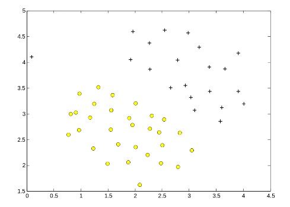
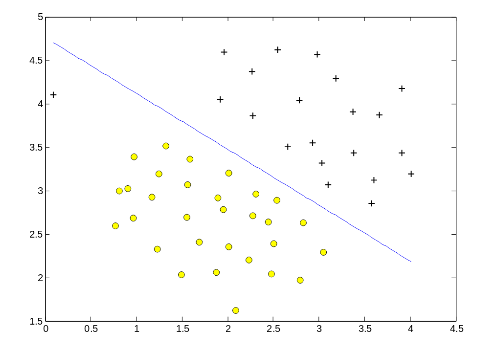
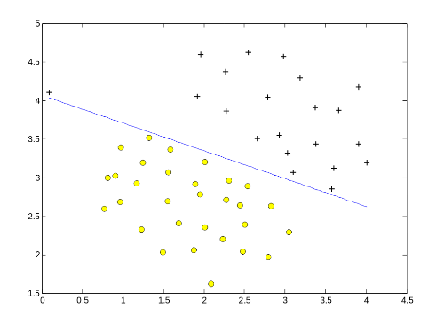
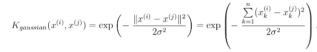
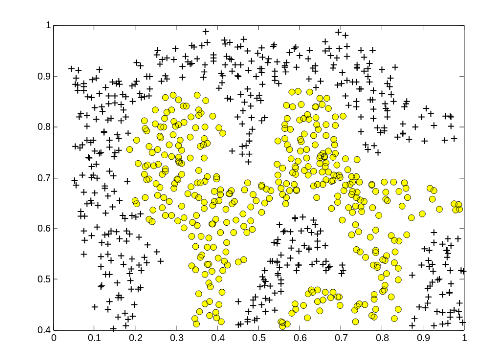
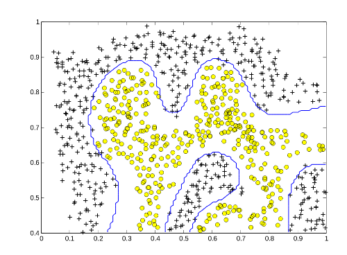
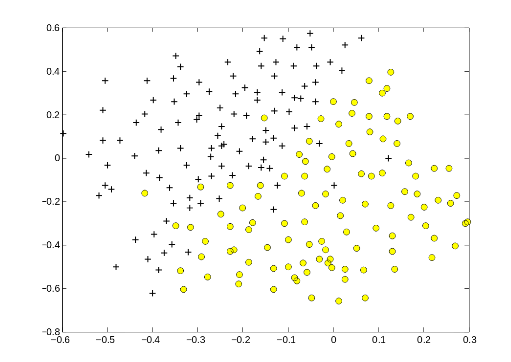
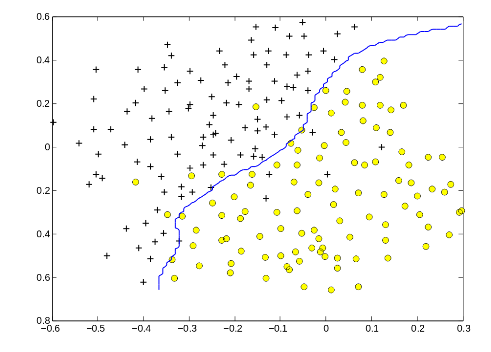
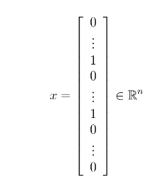

# プログラミング演習6: サポート・ベクター・マシン

機械学習

## はじめに

この演習では、サポート・ベクター・マシン（SVM）を使用してスパム分類器を作成します。
プログラミング演習を始める前に、ビデオ講義を見て、関連トピックのレビュー質問を完了することを強くお勧めします。

演習を開始するには、スターター・コードをダウンロードし、演習を終了するディレクトリーにその内容を解凍する必要があります。
必要に応じて、この演習を開始する前にOctave/MATLABのcdコマンドを使用してこのディレクトリーに移動してください。

また、コースウェブサイトの「環境設定手順」にOctave/MATLABをインストールするための手順も記載されています。

## この演習に含まれるファイル

 - ex6.m - 演習の手順を示すOctave/MATLABスクリプト
 - ex6data1.mat - サンプルのデータセット1
 - ex6data2.mat - サンプルのデータセット2
 - ex6data3.mat - サンプルのデータセット3
 - svmTrain.m - SVMトレーニング関数
 - svmPredict.m - SVM予測関数
 - plotData.m - 2Dデータをプロットする
 - visualizeBoundaryLinear.m - 線形境界をプロットする
 - visualizeBoundary.m - 非線形境界をプロットする
 - linearKernel.m - SVM用の線形カーネル
 - [\*] gaussianKernel.m - SVM用のガウス・カーネル
 - [\*] dataset3Params.m - データセット3に使用するパラメーター
 - ex6 spam.m - 演習の後半のOctave/MATLABスクリプト
 - spamTrain.mat - スパムトレーニング・セット
 - spamTest.mat - スパムテスト・セット
 - emailSample1.txt - サンプルメール1
 - emailSample2.txt - サンプルメール2
 - spamSample1.txt - スパムのサンプル1
 - spamSample2.txt - スパムのサンプル2
 - vocab.txt - 単語の一覧
 - getVocabList.m - 単語の一覧をロードする
 - porterStemmer.m - ステミング機能
 - readFile.m - ファイルを文字列に読み込みます
 - submit.m - 解答を我々のサーバーに送信するスクリプト
 - [\*] processEmail.m - メールの前処理
 - [\*] emailFeatures.m - メールからのフィーチャー抽出
 
 \* はあなたが完了する必要があるものを示しています

演習では、スクリプトex6.mを使用します。
これらのスクリプトは、問題に対するデータセットをセットアップし、あなたが実装する関数を呼び出します。
こららのスクリプトを変更する必要はありません。
この課題の指示に従って、他のファイルの関数を変更することだけが求められています。

### 助けを得る場所

このコースの演習では、数値計算に適した高度なプログラミング言語であるOctave（※1）またはMATLABを使用します。
OctaveまたはMATLABがインストールされていない場合は、コースWebサイトのEnvironment Setup Instructionsのインストール手順を参照してください。

Octave/MATLABコマンドラインでは、`help`の後に関数名を入力すると、組み込み関数のドキュメントが表示されます。
たとえば、`help plot`はプロットのヘルプ情報を表示します。
Octave関数の詳細のドキュメントは、[Octaveのドキュメントページ](www.gnu.org/software/octave/doc/interpreter/)にあります。
MATLABのドキュメントは、[MATLABのドキュメントページ](http://jp.mathworks.com/help/matlab/?refresh=true)にあります。

また、オンライン・ディスカッションを使用して、他の学生との演習について話し合うことを強く推奨します。
しかし、他人が書いたソースコードを見たり、他の人とソースコードを共有したりしないでください。

※1：Octaveは、MATLABの無料の代替ソフトウェアです。
プログラミング演習は、OctaveとMATLABのどちらでも使用できます。

## 1. サポート・ベクター・マシン

この演習の前半では、サポート・ベクター・マシン（SVM）とさまざまな2Dデータセットのサンプルを使用します。
これらのデータセットを試してみることで、SVMの仕組みやSVMでガウス・カーネルを使用する方法の直感を得ることができます。
演習の後半では、サポート・ベクター・マシンを使用してスパム分類器を作成します。
提供されたスクリプトex6.mは、演習の前半を進めるに役立ちます。

### 1.1. サンプルデータセット1

線形境界で分離できる2次元のサンプルデータセットから始めましょう。
スクリプトex6.mはトレーニング・データをプロットします（図1）。
このデータセットでは、正の例（+で示される）および負の例（oで示される）の位置は、ギャップによって示される自然な分離を示唆します。
しかし、外れ値の正の例+が左端に約（0.1、4.1）にあることに注意してください。
この演習の一環として、この異常値がSVMの決定境界にどのように影響するかも分かります。



&nbsp;&ensp;&nbsp;&ensp; 図1: サンプルデータセット1

演習のこのパートでは、SVMでさまざまな値のパラメーターCを使用してみます。
非公式には、パラメーターCは、誤分類されたトレーニング・サンプルのペナルティーを制御する正の値です。
大きなパラメーターCは、すべてのサンプルを正しく分類するようにSVMに指示します。
Cはと同様の役割を果たします。
ここで、はロジスティック回帰のためにこれまで使用していた正則化パラメーターです。



&nbsp;&ensp;&nbsp;&ensp; 図2: C=1でのSVM決定境界（サンプルデータセット1）



&nbsp;&ensp;&nbsp;&ensp; 図3: C=100でのSVM決定境界（サンプルデータセット1）

ex6.mの次のパートでは、svmTrain.m（※2）に含まれているSVMソフトウェアを使用して、C = 1でSVMトレーニングを実行します。
C = 1の場合、SVMは2つのデータセット間のギャップに決定境界を引き、一番左のデータポイントを誤って分類することが分かります（図2）。

※2：Octave/MATLABとの互換性を保証するために、このSVM学習アルゴリズムの実装を含めました。
ただし、この特殊な実装は、互換性を最大限にするために選ばれており、あまり効率的ではありません。
実際の問題でSVMをトレーニングする場合（特に大きなデータセットに拡張する必要がある場合）は、[LIBSVM](http://www.csie.ntu.edu.tw/%7Ecjlin/libsvm/)などの高度に最適化されたSVMツールボックスを使用することを強くお勧めします。

----

**実装上の注意：**

ほとんどのSVMソフトウェアパッケージ（svmTrain.mを含む）は、自動的に別のフィーチャーを追加し、自動的に切片項を学習します。
したがって、トレーニング・データをSVMソフトウェアに渡すときには、このフィーチャーを自分で追加する必要はありません。
特に、Octave/MATLABでは、コードはトレーニング・サンプルx∈Rn（x∈Rn+1ではなく）で作業する必要があります。
たとえば、最初のサンプルのデータセットはx∈R2です。

----

あなたがすべきことは、このデータセット上で異なる値のCを試すことです。
具体的には、スクリプトのCの値をC = 100に変更し、SVMトレーニングを再度実行する必要があります。
C = 100の場合、SVMはすべての単一のサンプルを正しく分類するようになりますが、データの自然な適合ではないような決定境界をします（図3）。

### 1.2. ガウス・カーネルを用いたSVM

この演習では、非線形分類を行うためにSVMを使用します。
特に、線形に分離できないデータセットでは、ガウス・カーネルを用いたSVMを使用することになります。

#### 1.2.1. ガウス・カーネル

SVMで非線形の決定境界を見つけるには、最初にガウス・カーネルを実装する必要があります。
ガウス・カーネルは、一対のサンプル(x(i), x(j))の間の「距離」を測定する類似関数として考えることができます。
ガウス・カーネルはまた、バンド幅パラメーターσによってパラメーター化されます。
このパラメーターはサンプルが離れていくにつれて、類似度メトリックがどれだけ速く（0に）減少するかを決定します。

gaussianKernel.mのコードを完成させて、2つの例(x(i), x(j))の間のガウス・カーネルを計算する必要があります。
ガウス・カーネル関数は、以下のように定義されます。



gaussianKernel.m関数を完成させたら、ex6.mスクリプトは与えられた2つのサンプルでカーネル関数をテストします。
実装が正しければ、0.324652が出力されるはずです。

*ここで解答を提出する必要があります。*

#### 1.2.2. サンプルデータセット2



&nbsp;&ensp;&nbsp;&ensp; 図4: サンプルデータセット2

ex6.mの次のパートでは、データセット2をロードしてプロットします（図4）。
図から、このデータセットの正のサンプルと負のサンプルを分ける線形の決定境界がないことを理解できます。
ただし、SVMでガウス・カーネルを使用することで、データセットに対して合理的にうまく実行できる非線形の決定境界を知ることができます。

ガウス・カーネル関数を正しく実装していれば、ex6.mはこのデータセット上のガウス・カーネルを使ってSVMをトレーニングします。



&nbsp;&ensp;&nbsp;&ensp; 図5: SVM（ガウス・カーネル）決定境界（サンプルデータセット2）

図5は、ガウシアンカーネルを用いたSVMによって見出された決定境界を示しています。
決定境界は、正と負のサンプルのほとんどを正しく分離し、データセットの輪郭によく従っています。

#### 1.2.3. サンプルデータセット3

この演習では、ガウス・カーネルを用いたSVMを使用する方法について、より実践的なスキルを身に付けることになります。
ex6.mの次のパートがロードされ、3番目のデータセットが表示されます（図6）。
このデータセットとともにガウス・カーネルを用いたSVMを使用します。



&nbsp;&ensp;&nbsp;&ensp; 図6 サンプルデータセット3

提供されたデータセット（ex6data3.mat）により、変数X、y、Xval、yvalが与えられます。
ex6.mで提供されたコードは、dataset3Params.mからロードされたパラメーターを使用して、トレーニング・セット(X, y)でSVM分類器をトレーニングします。

あなたがすべきことは、クロス・バリデーション・セットXval、yvalを使用して、使用する最良のCおよびσパラメーターを決定することです。
パラメーターCとσを検索するのに役立つ追加のコードを書く必要があります。
Cとσの両方について、乗法的なステップで値を試すことをお勧めします（例：0.01,0.03,0.1,0.3,1,3,10,30）。
Cとσのすべての可能な値のペア（たとえば、C = 0.3とσ= 0.1）を試してください。
たとえば、上記のCとσ^2の8つの値を試してみると、合計で8^2=64の異なるモデルをトレーニングし、評価することになります（クロス・バリデーション・セットで）。

使用する最適なパラメーターCおよびσを決定してそれを返すように、dataset3Params.mのコードを変更してください。
最適のパラメーターで、SVMが返す決定境界を図7に示します。



&nbsp;&ensp;&nbsp;&ensp; 図7: SVM（ガウス・カーネル）決定境界（サンプルデータセット3）

----

**実装のヒント：**

使用する最適なパラメーターCおよびσを選択するためにクロス・バリデーションを実装する場合は、クロス・バリデーション・セットの誤差を評価する必要があります。
分類において、誤差は、誤って分類されたクロス・バリデーションのサンプルの割合として定義されることを思い出してください。
Octave/MATLABでは、mean(double(predictions ~= yval))を使用してこの誤差を計算できます。
ここで、predictionはSVMからのすべての予測を含むベクトルで、yvalはクロス・バリデーション・セットから取得した真のラベルです。
svmPredict関数を使用して、クロス・バリデーション・セットの予測を生成することができます。

----

*ここで解答を提出する必要があります。*

## 2. スパム分類

現在、多くの電子メールサービスには、電子メールを迷惑メールと非迷惑メールに高い精度で分類できる迷惑メールフィルタが用意されています。
この演習では、SVMを使用して独自のスパムフィルタを構築します。
特定の電子メールxがスパム（）であるか、非スパム（）であるかを分類するために分類器をトレーニングします。
特に、各電子メールをフィーチャーベクトルx∈Rnに変換する必要があります。
以下の演習では、このようなフィーチャーベクトルを電子メールからどのように構築するかについて説明します。
この演習の残りのパートでは、スクリプトex6_spam.mを使用します。
この演習に含まれるデータセットは、SpamAssassin Public Corpus（※3）のサブセットに基づいています。
この演習の目的においては、電子メールの本文（電子メールのヘッダーを除く）のみを使用します。

※3：http://spamassassin.apache.org/old/publiccorpus/

### 2.1. 電子メールの前処理

```
> Anyone knows how much it costs to host a web portal ?
>
Well, it depends on how many visitors youre expecting. This can be 
anywhere from less than 10 bucks a month to a couple of $100. You 
should checkout http://www.rackspace.com/ or perhaps Amazon EC2 if 
youre running something big..

To unsubscribe yourself from this mailing list, send an email to: 
groupname-unsubscribe@egroups.com
```

&nbsp;&ensp;&nbsp;&ensp; 図8: サンプルの電子メール

機械学習のタスクを開始する前に、データセットのサンプルを見てみるのが賢明です。
図8は、URL、電子メールアドレス（最後の）、数字、および金額を含むサンプルの電子メールを示しています。
多くの電子メールには、同じ種類のエンティティ（数字、その他のURL、その他の電子メールアドレスなど）が含まれますが、特定のエンティティ（特定のURLや特定の金額など）はほぼすべての電子メールで異なります。
したがって、電子メールの処理によく使用される方法の1つは、これらの値を「標準化」（normalize）することで、すべてのURLが同じ扱いとなり、すべての数字が同じ扱いになります。
たとえば、電子メールの各URLが存在したことを示すために、URLを一意の文字列「httpaddr」に置き換えることができます。

これは、特定のURLが存在するかどうかではなく、URLが存在するかどうかに基づいて分類を決定するようにする効果があります。
スパマーはURLをランダム化することが多く、新しいスパムで特定のURLを再び見る確率は非常に低いため、通常、スパム分類器のパフォーマンスが向上します。
processEmail.mでは、以下の電子メールの事前処理と標準化の手順を実装しました。

 - 小文字変換：電子メール全体が小文字に変換されるため、大文字の使用は無視されます（たとえば、IndIcaTEはIndicateと同じように扱われます）。
 - HTMLタグの削除：すべてのHTMLタグが電子メールから削除されます。多くの電子メールにはHTML形式が付いていることがよくあります。すべてのHTMLタグが削除されるので、コンテンツのみが残ります。
 - URLの標準化：すべてのURLは「httpaddr」というテキストに置き換えられます。
 - 電子メールアドレスの標準化：すべての電子メールアドレスは「emailaddr」というテキストに置き換えられます。
 - 数値の標準化：すべての数値はテキスト「number」に置き換えられます。
 - ドルの標準化：すべてのドル記号（$）はテキスト「dollar」に置き換えられます。
 - 単語のステミング：言葉はその語幹の形に縮小されます。たとえば、「discount」、「discounts」、「discounted」、「discounting」はすべて「discount」に置き換えられます。 ステマーは実際に最後から文字を取り除くことがあるので、「include」、「includes」、「included」、「including」はすべて「includ」に置き換えられます。
 - 非単語の削除：単語や句読点が削除されます。すべての空白（タブ、改行、空白）は、すべて1つの空白文字に切り詰められます。

これらの前処理手順の結果を図9に示します。
前処理では単語の断片や単語以外のものが残っていますが、この形式はフィーチャー抽出を実行するよりはるかに簡単です。

```
anyon know how much it cost to host a web portal well it depend on how
mani visitor your expect thi can be anywher from less than number buck
a month to a coupl of dollarnumb you should checkout httpaddr or perhap 
amazon ecnumb if your run someth big to unsubscrib yourself from thi 
mail list send an email to emailaddr
```

&nbsp;&ensp;&nbsp;&ensp; 図9: 前処理後のサンプルの電子メール

<table style="border-style: none;vertical-align: bottom"><tr><td>
 
```
1 aa
2 ab
3 abil
...
86 anyon
...
916 know
...
1898 zero
1899 zip
```

&nbsp;&ensp;&nbsp;&ensp; 図10: 語彙のリスト
</td><td>

```
86 916 794 1077 883
370 1699 790 1822
1831 883 431 1171
794 1002 1893 1364
592 1676 238 162 89
688 945 1663 1120
1062 1699 375 1162
479 1893 1510 799
1182 1237 810 1895
1440 1547 181 1699
1758 1896 688 1676
992 961 1477 71 530
1699 531
```

&nbsp;&ensp;&nbsp;&ensp; 図11: サンプル電子メールの単語のインデックス
</td></tr></table>

#### 2.1.1. 語彙リスト

電子メールを前処理した後、図9のような電子メールごとの単語リストが表示されます。
次のステップは、分類器で使用したい単語と、除外したい単語を選択することです。

この演習では、最も頻繁に出現する単語のみを考慮した単語（語彙リスト）を選択しました。
トレーニング・セットではめったに発生しない言葉は少数の電子メールにしか含まれていないため、モデルによってトレーニング・セットが過大になる可能性があります。
完全な語彙リストは、ファイルvocab.txtにあり、図10にも示されています。
語彙リストは、スパムコーパスで少なくとも100回発生するすべての単語を選択することで選出され、1899語のリストになりました。
実際には、約10,000?50,000語の語彙リストがよく使われます。

語彙リストが与えられると、図9のような事前処理された電子メールの各単語を、語彙リスト内の単語のインデックスを含む単語インデックスのリストにマッピングすることができます。
図11は、サンプル電子メールのマッピングを示しています。
具体的には、サンプル電子メールでは、「anyone」という単語が最初に「anyon」に正規化されてから、語彙リストのインデックス86にマッピングされました。

あなたがすべきことは、このマッピングを実行するためにprocessEmail.mのコードを完成させることです。
コードでは、処理された電子メールからの単一の単語である文字列strが与えられます。
語彙リストvocabListの中の単語を調べ、単語が語彙リストに存在するかどうかを調べてください。
単語が存在する場合は、その単語のインデックスを変数word_indicesに追加する必要があります。
単語が存在せず、したがって語彙にない場合は、単語をスキップできます。

processEmail.mを実装してからスクリプトex6 spam.mが電子メールサンプルでコードを実行すると、図9および図11のような出力が表示されます。

----

#### Octave/MATLABのヒント:

Octave/MATLABでは、strcmp関数で2つの文字列を比較できます。
たとえば、strcmp(str1, str2)は、両方の文字列が等しい場合にのみ1を返します。
提供されているスターター・コードでは、vocabListは語彙内の単語を含む「セル配列」です。
Octave/MATLABでは、セル配列は通常の配列（つまりベクトル）と似ていますが、その要素は文字列で（通常のOctave/MATLABの行列やベクトルではできません） 、角括弧の代わりに中括弧を使用してそれらに入力します。
具体的には、インデックスiで単語を取得するには、vocabList{i}を使用します。
length(vocabList)を使用して、語彙の単語数を取得することもできます。

----

*ここで解答を提出する必要があります。*

### 2.2　電子メールからのフィーチャーの抽出

次に各電子メールをRnのベクトルに変換するフィーチャー抽出を実装します。
この演習では、語彙リストでn = #の単語を使用します。
具体的には、電子メールのフィーチャーxi∈{0,1}は、辞書内のi番目の単語が電子メール内に出現するかどうかに対応します。
つまり、電子メールにi番目の単語がある場合は<a href="https://www.codecogs.com/eqnedit.php?latex=\inline&space;x^{(i)}" target="_blank"></a> = 1、電子メールにi番目の単語がない場合は<a href="https://www.codecogs.com/eqnedit.php?latex=\inline&space;x^{(i)}" target="_blank"></a> = 0となります。
したがって、一般的な電子メールでは、このフィーチャーは次のようになります。



emailFeatures.mのコードを完成させて、電子メールのためのフィーチャーベクトルを生成する必要があります。

emailFeatures.mを実装すると、ex6_spam.mの次のパートが電子メールサンプルでコードを実行します。
フィーチャーベクトルの長さは1899で、ゼロではないエントリは45であることが分かります。

*ここで解答を提出する必要があります。*

### 2.3. スパム分類のためのSVMトレーニング

フィーチャー抽出機能を完了したら、ex6_spam.mの次のステップで、SVM分類器をトレーニングするために使用される前処理されたトレーニング・データセットを読み込みます。
spamTrain.matには、スパムメールと非スパムメールのトレーニング・サンプルが4000件含まれていますが、spamTest.matには1000件のテストサンプルが含まれています。
オリジナルの電子メールは、それぞれprocessEmail関数とemailFeatures関数を使用して処理され、ベクトルx(i) ∈ R^1899に変換されました。

データセットをロードした後、ex6_spam.mはSVMをトレーニングしてスパム()と非スパム()の電子メールを分類します。
トレーニングが完了すると、分類器が約99.8％のトレーニング精度と約98.5％のテスト精度を得ることが分かります。

### 2.4. スパムの上位予測

```
our click remov guarante visit basenumb dollar will price pleas nbsp
most lo ga dollarnumb
```

&nbsp;&ensp;&nbsp;&ensp; 図12: 迷惑メールの上位予測
 
スパム分類器の仕組みをよりよく理解するために、パラメーターを検査して、分類器がスパムを最も予測していると考える単語を確認することができます。
ex6 spam.mの次のステップでは、分類器で最大の正の値を持つパラメーターが検索され、対応する単語が表示されます（図12）。
したがって、電子メールに「guarantee」、「remove」、「dollar」、「price」などの単語が含まれていると（図12の上部の予測変数）、スパムとして分類される可能性があります。

### 2.5. オプション（非評価）の演習：自分のメールを試してみる

スパム分類器をトレーニングしたので、自分のメールでそれを試してみることができます。
スターター・コードには、2つの電子メールのサンプル（emailSample1.txtとemailSample2.txt）と2つのスパムのサンプル（spamSample1.txtとspamSample2.txt）が含まれています。
ex6の最後のパートであるspam.mは、最初のスパムのサンプルにスパム分類器を実行し、学習したSVMを使用して分類します。
ここで提供している他のサンプルを試して、分類器が正しいかどうかを確認する必要があります。
また、サンプル（プレーンテキストファイル）を独自のメールに置き換えることで、自分のメールを試すこともできます。

*このオプションの（非評価）演習は、解答を提出する必要はありません。*

### 2.6. オプション（非評価）の演習：独自のデータセットを構築する

この演習では、前処理されたトレーニング・セットとテスト・セットを提供しました。
これらデータセットは、今完了した同じ関数（processEmail.mとemailFeatures.m）を使用して作成されました。
このオプション（非評価）の演習、SpamAssassin Pubic Corpusの元の電子メールを使用して独自のデータセットを構築します。
このオプション（非評価）の演習で、あなたがすべきことは、[パブリックコーパス](http://spamassassin.apache.org/old/publiccorpus/)からオリジナルのファイルをダウンロードし、それらを抽出することです。
それらを抽出したら、それぞれの電子メールでprocessEmail（※4）およびemailFeatures関数を実行して、各電子メールからフィーチャーベクトルを抽出する必要があります。
これにより、サンプルのデータセットX、yを構築できます。
その後、データセットを無作為にトレーニング・セット、クロス・バリデーション・セット、テスト・セットに分割する必要があります。
独自のデータセットを作成する際には、（データセット内に出現する高頻度の単語を選択して）独自の語彙リストを作成し、役立つと思われるフィーチャーを追加することをお勧めします。
最後に、[LIBSVM](http://www.csie.ntu.edu.tw/%7Ecjlin/libsvm/)など高度に最適化されたSVMツールボックスを使用することもお勧めします。

*このオプションの（非評価）演習は、解答を提出する必要はありません。*

※4：オリジナルの電子メールには、削除する可能性がある電子メールヘッダーがあります。
これらのヘッダーを削除するのに役立つコードをprocessEmailに含めています。

## 提出と採点

この課題が完了したら、送信機能を使用して解答を我々のサーバーに送信してください。
以下は、この演習の各パートの得点の内訳です。

| パート | 提出するファイル | 点数　|
----|----|---- 
| ガウス・カーネル | gaussianKernel.m | 25 点 |
| データセット3のパラメーター（C、σ） | dataset3Params.m | 25 点 |
| 電子メール前処理 | processEmail.m | 25 点 |
| メールフィーチャーの抽出 | emailFeatures.m | 25 点 |
| 合計点 |  | 100 点 |

解答を複数回提出することは許可されており、最高のスコアのみを考慮に入れます。
