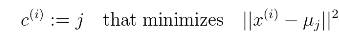
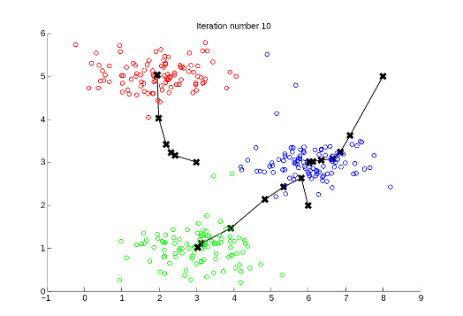
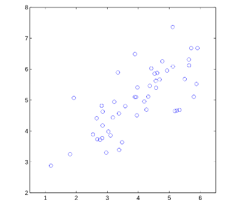

# プログラミング演習7: K-meansクラスタリングと主成分分析

機械学習

## はじめに

この演習では、K-meansクラスタリング・アルゴリズムを実装し、それを適用して画像を圧縮します。
2番目のパートでは、主成分分析を使用して、顔の画像の低次元の表現を検索します。
プログラミング演習を始める前に、ビデオ講義を見て、関連トピックのレビュー質問を完了することを強くお勧めします。

演習を開始するには、スターター・コードをダウンロードし、演習を終了するディレクトリーにその内容を解凍する必要があります。
必要に応じて、この演習を開始する前にOctave/MATLABの`cd`コマンドを使用してこのディレクトリーに移動してください。

また、コースウェブサイトの「環境設定手順」にOctave/MATLABをインストールするための手順も記載されています。

## この演習に含まれるファイル

 - `ex7.m` - K-meansの最初の演習のためのOctave/MATLABスクリプト
 - `ex7_pca.m` - PCAでの2番目の練習用のOctave/MATLABスクリプト
 - `ex7data1.mat` - PCAのサンプル・データセット
 - `ex7data2.mat` - K-meansのデータセットのサンプル
 - `ex7faces.mat` - 顔データセット
 - `bird_small.png` - サンプル画像
 - `displayData.m` - 行列に格納された2Dデータを表示する
 - `drawLine.m` - 元の図形に線を描画する
 - `plotDataPoints.m` - K-means重心の初期化
 - `plotProgresskMeans.m` - 進行中のK-meansの各ステップをプロットする
 - `runkMeans.m` - K-meansアルゴリズムを実行する
 - `submit.m` - 解答を我々のサーバーに送信するスクリプト
 - [\*] `pca.m` - 主成分分析を実行する
 - [\*] `projectData.m` - データセットをより低い次元の空間に射影する
 - [\*] `recoverData.m` - 元のデータを射影から復元する
 - [\*] `findClosestCentroids.m` - 最も近い重心を見つける（K-meansで使用）
 - [\*] `computeCentroids.m` - 重心の平均の計算（K-meansで使用）
 - [\*] `kMeansInitCentroids.m` - K-meansの重心の初期化
 
 \* はあなたが完了する必要があるものを示しています。

演習では、スクリプト`ex7.m`を使用します。
演習の最初のパートではスクリプト`ex7.m`を使用し、2番目のパートでは`ex7_pca.m`を使用します。
これらのスクリプトは、問題に対するデータセットをセットアップし、あなたが実装する関数を呼び出します。
こららのスクリプトを変更する必要はありません。
この課題の指示に従って、他のファイルの関数を変更することだけが求められています。

### 助けを得る場所

このコースの演習では、数値計算に適した高度なプログラミング言語であるOctave（※1）またはMATLABを使用します。
OctaveまたはMATLABがインストールされていない場合は、コースWebサイトのEnvironment Setup Instructionsのインストール手順を参照してください。

Octave/MATLABコマンドラインでは、`help`の後に関数名を入力すると、組み込み関数のドキュメントが表示されます。
たとえば、`help plot`はプロットのヘルプ情報を表示します。
Octave関数の詳細のドキュメントは、[Octaveのドキュメントページ](www.gnu.org/software/octave/doc/interpreter/)にあります。
MATLABのドキュメントは、[MATLABのドキュメントページ](http://jp.mathworks.com/help/matlab/?refresh=true)にあります。

また、オンライン・ディスカッションを使用して、他の学生との演習について話し合うことを強く推奨します。
しかし、他人が書いたソースコードを見たり、他の人とソースコードを共有したりしないでください。

※1：Octaveは、MATLABの無料の代替ソフトウェアです。
プログラミング演習は、OctaveとMATLABのどちらでも使用できます。

## 1. K-meansクラスタリング

この演習では、K-meansアルゴリズムを実装し、画像圧縮に使用します。
最初に、K-meansアルゴリズムの仕組みを直感的に理解するための2Dデータセットのサンプルで始めます。
その後、画像に現れる色の数をその画像で最も一般的な色の数に減らすため、画像圧縮にK-meansアルゴリズムを使用します。
演習のこのパートでは、`ex7.m`を使用します。

### 1.1. K-meansの実装

K-meansアルゴリズムは、類似のデータのサンプルを自動的にクラスタリングする方法です。
具体的には、与えられたトレーニング・セット  （ここで、）に対して、データをいくつかのまとまった「クラスター」にグループ化したいということです。
K-meansの背景にある直感は、最初の重心を推測することから始まり、次に最も近い重心にサンプルを繰り返し割り当て、それに基づいて重心を再計算することによって、この推測を洗練する反復手順であると言えます。
K-meansアルゴリズムは以下の通りです。

```
% 重心を初期化する
centroids = kMeansInitCentroids(X, K);
for iter = 1:iterations
    % クラスタ割り当てステップ: 
    % 各データ点を最も近い重心に割り当てます。idx(i)は、
    % c^(i)（サンプルiに割り当てられた重心のインデックス）に対応します。
    idx = findClosestCentroids(X, centroids);

    % 重心移動ステップ：
    % 重心の割り当てに基づいて平均を計算します。
    centroids = computeMeans(X, idx, K);
end
```

アルゴリズムの内部ループは、次の2つのステップを繰り返し実行します。

- (i) 各トレーニング・サンプルをその最も近い重心に割り当てる
- (ii) 割り当てられたポイントを使用して各重心の平均を再計算する

K-meansアルゴリズムは、いくつかの重心の平均の最終的なセットに常に収束します。
収束した解は必ずしも理想的ではなく、重心の初期設定に依存することに注意してください。
したがって、実際にK-meansアルゴリズムは、通常、異なるランダム初期化を用いて数回実行されます。
異なるランダム初期化からこれらの異なる解を選択する方法の1つは、コスト関数値（歪み）が最も低いものを選択することです。
次のセクションでは、K-meansアルゴリズムの2つのフェーズを個別に実装します。

#### 1.1.1. 最も近い重心を求める

K-meansアルゴリズムの「クラスター割り当て」の段階では、アルゴリズムは、現在の重心の位置を考慮して、すべてのトレーニング・サンプルをその最も近い重心に割り当てます。
具体的には、設定したすべてのサンプルに対して、



ここで、はに最も近い重心のインデックスであり、は番目の重心の位置（値）です。
は、スターター・コードの`idx(i)`に対応することに注意してください。

あなたがすべきことは、`findClosestCentroids.m`でコードを完成させることです。
この関数は、データ行列`X`と重心の中のすべての重心の位置を取り、最も近い重心のインデックスを各トレーニング・サンプルに保持する1次元配列`idx`（の値、ここでは重心の総数です）を出力する必要があります。

すべてのトレーニング・サンプルと各重心のループを使用して、これを実装できます。

`findClosestCentroids.m`でコードを完成し、スクリプト`ex7.m`がコードを実行すると、最初の3つのサンプルの重心の割り当てに対応する出力`[1 3 2]`が表示されます。

*ここで解答を提出する必要があります。*

#### 1.1.2. 重心の平均の計算

与えられた全ての点の重心の割り当てについて、アルゴリズムの第2段階は、各重心に対して、それに割り当てられた点の平均を再計算します。
具体的には、すべての重心に対して、

 

ここでは重心に割り当てられたサンプルのセットです。
具体的には、とが重心に割り当てられているとする2つのサンプルがある場合、を更新する必要があります。

これで`computeCentroids.m`のコードを完成させられるはずです。
この関数は、重心のループを使用して実装できます。
サンプルにループを使用することもできます。
そのようなループを使用しないベクトル化された実装を使用することができれば、コードはより速く実行される可能性があります。

`computeCentroids.m`でコードを完成すると、`ex7.m`スクリプトはコードを実行し、K-meansの最初のステップの後に重心を出力します。

*ここで解答を提出する必要があります。*

### 1.2. サンプル・データセットのK-means



&nbsp;&ensp;&nbsp;&ensp; 図1: 期待される出力

2つの関数（`findClosestCentroids`と`computeCentroids`）を完了すると、`ex7.m`の次のステップでK-meansアルゴリズムがトイ2Dデータセットで実行され、K-meansの仕組みを理解できます。
関数は、`runkMeans.m`スクリプトの中から呼び出されます。
どのように機能するかを理解するために関数を見てみることをお勧めします。
このコードは、ループで実装した2つの関数を呼び出しています。
次のステップを実行すると、K-meansコードは、各繰り返しでアルゴリズムの進捗状況を表示する可視化を生成します。
<kbd>Enter</kbd>キーを何度か押して、K-meansアルゴリズムの各ステップが重心とクラスター割り当てをどのように変更するかを確認します。
最後に、図は図1のように表示されます。

### 1.3. ランダム初期化

`ex7.m`のサンプル・データセットの重心の最初の割り当ては、図1と同じ図が表示されるように設計されています。
実際には、重心を初期化するための良い方法は、トレーニング・セットからランダムなサンプルを選択することです。
この演習では、次のコードを使用して`kMeansInitCentroids.m`関数を完成させる必要があります。

```
% 重心をランダムに選択したサンプル初期化する

% サンプルのインデックスをランダムに並べ替えます
randidx = randperm(size(X, 1));
% 最初からK個のサンプルの重心として取る
centroids = X(randidx(1:K), :);
```

上記のコードは、最初に（`randperm`を使用して）サンプルのインデックスをランダムに置き換えます。
次に、インデックスのランダム置換に基づいて最初の個のサンプルを選択します。
これにより、同じサンプルを2回選択するリスクを伴わずに、サンプルをランダムに選択することができます。

### 1.4. K-meansによる画像圧縮


&nbsp;&ensp;&nbsp;&ensp; 図2: オリジナルの128x128イメージ

この演習では、画像圧縮にK-meansを適用します。
画像（※2）の直接的な24ビットカラー表現では、各ピクセルは、赤、緑、青の輝度値を指定する3つの8ビット符号なし整数（0～255の範囲）として表されます。
このエンコーディングは、RGBエンコーディングと呼ばれます。
画像には何千もの色が含まれていますが、この演習では色の数を16色に減らします。

この縮小を行うことで、写真を効率的に表現（圧縮）することができます。
具体的には、選択した16色のRGB値を保存するだけで済みます。
画像の各ピクセルについて、その位置に色のインデックスを格納する必要があります（16の可能性を表すのであれば、4ビットしか必要ありません）。

この演習では、K-meansアルゴリズムを使用して、圧縮画像を表すために使用される16色を選択します。
具体的には、原画像のすべてのピクセルをデータサンプルとして扱い、K-meansアルゴリズムを使用して、3次元RGB空間内のピクセルを最適にグループ化（クラスタリング）する16色を検索します。
画像のクラスター重心を計算したら、16色を使用して元の画像のピクセルを置き換えます。

※2: この練習で使用している写真は、Frank Woutersのものであり、彼の許可を得て使用しています。

#### 1.4.1. ピクセルのK-means

Octave/MATLABでは、次のように画像をロードすることができます。

```
% Load 128x128 color image (bird small.png)
A = imread('bird small.png');

% You will need to have installed the image package to used
% imread. If you do not have the image package installed, you
% should instead change the following line to
%
%    load('bird small.mat'); % Loads the image into the variable A
```

これにより、三次元行列Aの最初の2つのインデックスがピクセル位置を識別し、最後のインデックスが赤、緑、青のいずれかを表します。
たとえば、`A(50, 33, 3)`は50行33列のピクセルの青の輝度を示します。

`ex7.m`内のコードは、最初に画像をロードし、次にそれを再整形してのピクセルのカラー行列（）を作成し、K-means関数を呼び出します。

画像を表すために上位色を見つけた後、`findClosestCentroids`関数を使用して、各ピクセル位置を最も近い重心に割り当てることができます。
これにより、各ピクセルの重心の割り当てを使用して、元の画像を表現することができます。
画像を記述するために必要なビット数が、大幅に削減されていることに注意してください。
元の画像は、ピクセル位置のそれぞれに対して、24ビットを必要とし、合計サイズはビットとなります。
新しい表現は、24ビットを必要とする16色の辞書の形式でオーバヘッド記憶装置を必要としますが、画像そのものはピクセル位置当たり4ビットしか必要としません。
したがって、使用される最終ビット数は、ビットであり、原画像を約6倍に圧縮することになります。


&nbsp;&ensp;&nbsp;&ensp; 図3： 元の画像と再構築の画像（K-meansを使用して画像を圧縮する場合）

最後に、重心の割り当てのみに基づいて画像を再構築することで、圧縮の効果を表示できます。
具体的には、各ピクセルの位置を、それに割り当てられた重心の平均で置き換えることができます。
図3に、得られた再構築の画像を示します。
結果として得られる画像にはオリジナルの特性のほとんどが残っていますが、いくつかの圧縮のアーティファクトもあります。

*このオプションの（非評価）演習は、解答を提出する必要はありません。*

### 1.5. オプション（非評価）演習：あなた自身の画面を使用する

この演習では、あなたが持っている画像の1つで実行するために提供したコードを変更します。
画像が非常に大きい場合、K-meansは実行に時間がかかることに注意してください。
したがって、コードを実行する前にイメージを管理可能なサイズにリサイズすることをお勧めします。
圧縮に及ぼす影響を見るためにを変化させることもできます。

## 2. 主成分分析

この演習では、主成分分析（PCA）を使用して次元削減を行います。
最初に、2Dデータセットのサンプルを試して、PCAの仕組みを直感的に理解し、それを5000個の顔画像データセットのより大きなデータセットに使用します。
提供されたスクリプト、`ex7_pca.m`は、演習の前半を実行するのに役立ちます。

### 2.1. サンプルのデータセット

PCAの仕組みの理解に役立つように、まずは大きな変化の方向と小さな変化の方向を有する2つのデータセットから始めます。
スクリプト`ex7_pca.m`はトレーニング・データをプロットします（図4）。
演習のこのパートでは、PCAを使用して2Dから1Dにデータを縮小するときに起こることを可視化します。
実際には、データを256次元から50次元に縮小したいと考えるかもしれません。
このサンプルでは、低次元のデータを使用することで、アルゴリズムをよりよく可視化することができます。



&nbsp;&ensp;&nbsp;&ensp; 図4： サンプル・データセット1

### 2.2. PCAの実装

演習のこのパートでは、PCAを実装します。
PCAは2つの計算ステップで構成されています。
まず、データの共分散行列を計算します。
次に、Octave/MATLABの`SVD`関数を使用して、固有ベクトルを計算します。
これらは、データの変化の主成分に対応します。

PCAを使用する前に、まず各フィーチャーの平均値をデータセットから差し引いてデータを正規化し、各次元が同じ範囲になるように各次元をスケーリングすることが重要です。
提供したスクリプト`ex7_pca.m`では、`featureNormalize`関数を使用してこの正規化が実行されています。

データを正規化したら、PCAを実行して主成分を計算することができます。
あなたがすべきことは、`pca.m`のコードを完成させて、データセットの主成分を計算することです。
まず、データの共分散行列を以下により、計算する必要があります。

 
 
ここで、は行にサンプルを持つデータ行列で、は列の数です。 
は行列であり、総和演算子ではないことに注意してください。

共分散行列を計算した後、SVDを実行して主成分を計算することができます。
Octave/MATLABでは、次のコマンドでSVDを実行することができます。
`[U, S, V] = svd(Sigma)`ここで、`U`は主成分を含み、`S`は対角行列を含みます。


&nbsp;&ensp;&nbsp;&ensp; 図5： 計算されたデータセットの固有ベクトル

`pca.m`が完成すると、`ex7_pca.m`スクリプトはサンプル・データセットでPCAを実行し、見つかった対応する主成分をプロットします（図5）。
スクリプトはまた、見つかった中で最も高い主成分（固有ベクトル）を出力し、期待する出力は約`[-0.707 -0.707]`になります
（とが最初の主成分に対して等しく有効な選択肢なので、Octave/MATLABは代わりにこの負数を出力する可能性があります）。

*ここで解答を提出する必要があります。*

### 2.3. PCAによる次元の削減

主成分を計算した後、各サンプルをより低い次元の空間（たとえば、2Dから1Dに）に射影することにより、データセットのフィーチャーの次元を縮小できます。
この演習では、PCAから返された固有ベクトルを使用して、サンプルのデータセットを1次元空間に射影します。

実際には、線形回帰やニューラル・ネットワークなどの学習アルゴリズムを使用していた場合、元のデータの代わりに射影データを使用できるようになります。
射影されたデータを使用することで、入力に次元が少なくなるため、モデルをより早くトレーニングすることができます。

#### 2.3.1. 主成分へのデータの射影

これで`projectData.m`のコードを完成させられるはずです。
具体的には、データセット`X`、主成分`U`、および削減したい次元数`K`が与えられます。
`X`の各サンプルを`U`の上位`K`個の成分に射影する必要があります。
`U`の上位`K`個の成分は、`U`の最初の`K`個の列、すなわち`U_reduce = U(:, 1:K)`によって与えられることに注意してください。

`projectData.m`のコードを完成すると、`ex7_pca.m`は最初の次元に最初のサンプルを射影し、約`1.481`の値を表示します（の代わりにを指定した場合は`-1.481`）。

*ここで解答を提出する必要があります。*

#### 2.3.2. データの近似の再構築

下位次元空間にデータを射影した後、元の高次元空間に射影してデータを近似的に復元することができます。
あなたがすべきことは、`recoverData.m`を完了して、`Z`の各例を元の空間に射影し、リカバーした近似を`X_rec`に返すことです。
`recoverData.m`でコードを完成すると、`ex7_pca.m`は最初のサンプルの近似値をリカバーし、約`[-1.047 -1.047]`の値が表示されます。

今すぐ解答を提出する必要があります。

#### 2.3.3. 射影の可視化


&nbsp;&ensp;&nbsp;&ensp; 図6：PCA後に正規化と射影を行ったデータ

`projectData`と`recoverData`の両方を完成すると、`ex7_pca.m`は射影と近似の再構築の両方を実行し、射影がどのようにデータに影響するかを示します。
図6では、元のデータ点は青色の円で示され、射影されたデータ点は赤色の円で示されます。
射影は事実上、によって与えられた方向の情報のみを保持します。

### 2.4. 顔画像のデータセット

演習のこのパートでは、顔画像でPCAを実行して、実際に次元削減のためにどのように使用できるかを確認します。
データセット`ex7faces.mat`には、32×32のグレースケールの顔画像のデータセット`X`（※3）が含まれています。
`X`の各行は、1つの顔画像（長さ1024の行ベクトル）に対応します。
`ex7_pca.m`の次のステップは、これらの顔画像の最初の100個をロードして可視化します（図7）。

※3：このデータセットは、「[Labeled Faces in the Wild](http://vis-www.cs.umass.edu/lfw/)」のデータセットの[cropped version](http://itee.uq.edu.au/~conrad/lfwcrop/)をベースにしています。


&nbsp;&ensp;&nbsp;&ensp; 図7：顔のデータセット

#### 2.4.1. 顔のPCA

顔のデータセットでPCAを実行するには、最初にデータ行列`X`から各フィーチャーの平均を引いてデータセットを正規化します。
スクリプト`ex7_pca.m`がこれを行い、PCAコードを実行します。
PCAを実行すると、データセットの主成分が取得されます。
`U`（各行）の各主成分は、長さのベクトルです（顔データセットの場合、）。
これらの主成分を、元のデータセットのピクセルに対応する32×32の行列に再構築することによって、これらの主成分を可視化することができます。
スクリプト`ex7_pca.m`は、最大のバリエーションを記述する最初の36の主成分を表示します（図8）。
必要に応じて、コードを変更してより多くの主成分を表示し、より詳細なキャプチャー方法を確認することもできます。

#### 2.4.2. 次元の削減

これで、顔データセットの主成分を計算したので、これを使用して顔データセットの次元を減らすことができます。
これにより、元の1024の寸法ではなく、より小さな入力サイズ（たとえば100次元）で学習アルゴリズムを使用することができます。
これは学習アルゴリズムのスピードアップに役立ちます。


&nbsp;&ensp;&nbsp;&ensp; 図8：顔のデータセットの主成分


&nbsp;&ensp;&nbsp;&ensp; 図9：顔の元画像と上位100個の主成分のみから再構築された画像

`ex7_pca.m`の次の部分は、顔のデータセットを最初の100の主成分に射影します。
 具体的には、各顔画像をベクトルで記述します。

次元削減で失われたデータを理解するために、射影されたデータセットのみを使用してデータを復元できます。
`ex7_pca.m`により、データのおおよその復元が実行され、元の画像と射影された顔画像が並べて表示されます（図9）。
再構築から、細部が失われている一方、顔の一般的な構造と外観が維持されていることが分かります。
これは、学習アルゴリズムを大幅にスピードアップするのに役立つ、データセットサイズの大幅な縮小（10倍以上）です。
たとえば、人の認識を行うためにニューラル・ネットワークをトレーニングしていた場合（人物の識別を予測して、顔の画像を予測する）、元のピクセルの代わりに100次元のピクセルの削減された入力を使用できます。

### 2.5. オプション（非評価）の演習：可視化のためのPCA


&nbsp;&ensp;&nbsp;&ensp; 図10：3Dのオリジナルデータ

以前のK-means画像圧縮の演習では、3次元RGB空間でK-meansアルゴリズムを使用しました。
`ex7_pca.m`スクリプトの最後のパートでは、`scatter3`関数を使用して、この3D空間内の最終的なピクセル割り当てを可視化するためのコードを提供しました。
各データ点は、割り当てられたクラスターに従って色付けられます。
図の上でマウスをドラッグすると、このデータを3次元で回転して検査することができます。

3次元以上のデータセットを可視化することは面倒であることが分かっています。
したがって、いくつかの情報を失うことを犠牲にしても、2Dでデータを表示することが望ましいことがよくあります。
実際に、PCAは可視化の目的でデータの次元を減らすためによく使用されます。
`ex7_pca.m`の次のパートで、スクリプトはPCAの実装を3次元データに適用して2次元に縮小し、2D散布図で結果を可視化します。
PCAの射影は、データの広がりを最大化するビューを選択する回転と考えることができます。
これはしばしば「ベスト」な見方に相当します。
 


&nbsp;&ensp;&nbsp;&ensp; 図11：PCAを使用して生成された2Dの可視化

## 提出と採点

この課題が完了したら、送信機能を使用して解答を我々のサーバーに送信してください。
以下は、この演習の各パートの得点の内訳です。

| パート | 提出するファイル | 点数　|
----|----|---- 
| 最も近い重心の検出 | `findClosestCentroids.m` | 30 点 |
| 重心の平均の計算 | `computeCentroids.m` | 30 点 |
| PCA | `pca.m` | 20 点 |
| データのプロジェクト | `projectData.m` | 10 点 |
| データのリカバリー | `recoverData.m` | 10 点 |
| 合計点 |  | 100 点 |

解答を複数回提出することは許可されており、最高のスコアのみを考慮に入れます。
