# プログラミング演習8: 異常検出とレコメンダー・システム

機械学習

## はじめに

この演習では、異常検出アルゴリズムを実装し、それを適用してネットワーク上の障害のあるサーバーを検出します。
2番目のパートでは、協調フィルタリングを使用して映画のレコメンダー・システムを構築します。
プログラミング演習を始める前に、ビデオ講義を見て、関連トピックのレビュー質問を完了することを強くお勧めします。

演習を開始するには、スターター・コードをダウンロードし、演習を終了するディレクトリーにその内容を解凍する必要があります。
必要に応じて、この演習を開始する前にOctave/MATLABの`cd`コマンドを使用してこのディレクトリーに移動してください。

また、コースウェブサイトの「環境設定手順」にOctave/MATLABをインストールするための手順も記載されています。

## この演習に含まれるファイル

 - `ex8.m` - 演習の最初のパートのためのOctave/MATLABスクリプト
 - `ex8_cofi.m` - 演習の2番目のパートのためのOctave/MATLABスクリプト
 - `ex8data1.mat` - 最初のサンプルの異常検出のデータセット
 - `ex8data2.mat` - 2番目のサンプルの異常検出のデータセット
 - `ex8_movies.mat` - 映画のレビューのデータセット
 - `ex8_movieParams.mat` - デバッグ用に提供されるパラメーター
 - `multivariateGaussian.m` - ガウス分布の確率密度関数を計算する
 - `visualizeFit.m` - ガウス分布とデータセットの2次元プロット
 - `checkCostFunction.m` - 協調フィルタリングの勾配チェック
 - `computeNumericalGradient.m` - 数値的に勾配を計算する
 - `fmincg.m` - 関数最小化ルーチン（fminuncと同様）
 - `loadMovieList.m` - 映画のリストをセル配列にロードする
 - `movie_ids.txt` - 映画のリスト
 - `normalizeRatings.m` - 協調フィルタリングの平均正規化
 - `submit.m` - 解答を我々のサーバーに送信するスクリプト
 - [\*] `estimateGaussian.m` - 対角共分散行列を持つガウス分布のパラメーターを推定する
 - [\*] `selectThreshold.m` - 異常検出の閾値を見つける
 - [\*] `cofiCostFunc.m` - 協調フィルタリングのためのコスト関数を実装する
 
 \* はあなたが完了する必要があるものを示しています。

演習の最初のパート（異常検出）では、`ex8.m`スクリプトを使用します。
2番目のパート（協調フィルタリング）では、`ex8_cofi.m`を使用します。
これらのスクリプトは、問題に対するデータセットをセットアップし、あなたが実装する関数を呼び出します。
こららのスクリプトを変更する必要はありません。
この課題の指示に従って、他のファイルの関数を変更することだけが求められています。

### 助けを得る場所

このコースの演習では、数値計算に適した高度なプログラミング言語であるOctave（※1）またはMATLABを使用します。
OctaveまたはMATLABがインストールされていない場合は、コースWebサイトのEnvironment Setup Instructionsのインストール手順を参照してください。

Octave/MATLABコマンドラインでは、`help`の後に関数名を入力すると、組み込み関数のドキュメントが表示されます。
たとえば、`help plot`はプロットのヘルプ情報を表示します。
Octave関数の詳細のドキュメントは、[Octaveのドキュメントページ](www.gnu.org/software/octave/doc/interpreter/)にあります。
MATLABのドキュメントは、[MATLABのドキュメントページ](http://jp.mathworks.com/help/matlab/?refresh=true)にあります。

また、オンライン・ディスカッションを使用して、他の学生との演習について話し合うことを強く推奨します。
しかし、他人が書いたソースコードを見たり、他の人とソースコードを共有したりしないでください。

※1：Octaveは、MATLABの無料の代替ソフトウェアです。
プログラミング演習は、OctaveとMATLABのどちらでも使用できます。

## 1. 異常検出

この演習では、異常検出アルゴリズムを実装して、サーバー・コンピューターの異常動作を検出します。
この機能は、各サーバーのレスポンスのスループット（mb/s）とレイテンシー（ms）を測定します。
あなたは、サーバーが稼動している間にm = 307のサンプルを収集しており、ラベルなしのデータセット{x(1), . . . , x(m)}を持っています。
これらのサンプルの大部分は、正常に動作するサーバーの「通常の」（異常ではない）サンプルですが、このデータセット内に異常な動作をするサーバーのサンプルもいくつか存在する可能性があります。

ガウスモデルを使用して、データセット内の異常なサンプルを検出します。
最初に、アルゴリズムが何をしているのかを可視化できる2Dデータセットを開始します。
このデータセットでは、ガウス分布に適合し、確率が非常に低い値を見つけて、それ故に異常と見なすことができます。
その後、多数の次元を持つより大きなデータセットに異常検出アルゴリズムを適用します。
演習のこのパートでは、`ex8.m`を使用します。

`ex8.m`の最初のパートは、図1に示すようにデータセットを可視化します。

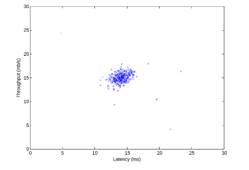

&nbsp;&ensp;&nbsp;&ensp; 図1：最初のデータセット

### 1.1. ガウス分布

異常検出を実行するには、まずデータの分布にモデルを適合させる必要があります。

与えられたトレーニングセット{x(1), ..., x(m)}（ここで x(i) ∈ Rn）に対して、各フィーチャー<a href="https://www.codecogs.com/eqnedit.php?latex=\inline&space;x^{(i)}" target="_blank"></a>のガウス分布を推定する必要があります。
各フィーチャーについて、i = 1...n,の場合、i番目の次元{x(1)i、...、x(m)i}（各サンプルのi番目の次元）のデータに適合するパラメーターμiとσi^2を見つける必要があります。
ガウス分布は、以下の式で与えられます。

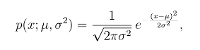

ここで、μは平均値、σ^2は分散を制御します。

### 1.2. ガウス分布のパラメーターの推定

次の式を使用して、i番目のフィーチャーのパラメーター(μi, σ2)を見積もることができます。
平均を推定するには、次を使用します。

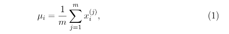

使用する分散は以下となります。

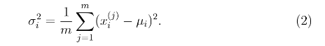

あなたがすべきことは、`estimateGaussian.m`のコードを完成させることです。
この関数は、データ行列Xを入力として受け取り、すべてのn個のフィーチャーの平均を保持するn次元ベクトルmuと、すべてのフィーチャーの分散を保持する別のn次元ベクトルsigma2を出力する必要があります。
すべての機能とすべてのトレーニングのサンプルでforループを使用して実装することができます。
ベクトル化された実装はより効率的かもしれませんが、そうしなくてもかまいません。
Octave/MATLABでは、var関数は（デフォルトで）σi^2を計算するときに1/mではなく1/(m-1)を使用することに注意してください。
 
`estimateGaussian.m`のコードを完成すると、`ex8.m`の次のパートでは、フィットしたガウス分布の輪郭が可視化されます。
図2のようなプロットが得られるはずです。
プロットから、ほとんどのサンプルが最も確率の高い領域にあり、異常なサンプルは確率が低い領域にあることが分かります。

*ここで解答を提出する必要があります。*

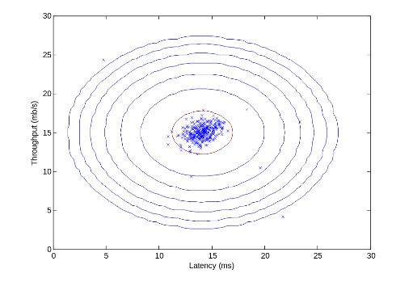

&nbsp;&ensp;&nbsp;&ensp; 図2：データセットにフィットする分布のガウス分布の等高線

### 1.3. 閾値εを選択する

ガウス分布のパラメーターを推定したので、どの分布のサンプルが非常に高い可能性があり、どの分布が非常に低いかを調べることができます。
低確率のサンプルは、我々のデータセットの異常である可能性が高いです。
どのサンプルが異常であるかを判断する1つの方法は、クロス・バリデーション・セットに基づいて閾値を選択することです。
演習のこのパートでは、クロス・バリデーション・セットでF1スコアを使用してしきい値εを選択するアルゴリズムを実装します。

ここで、`selectThreshold.m`のコードを完成させる必要があります。
このために、クロス・バリデーション・セット{(x(1)cv,y(1)cv),...,(x(mcv)cv ; y(mcv)cv)}を使用します。
ここで、ラベルは異常なサンプルに対応し、は通常のサンプルに対応します。
各クロス・バリデーションのサンプルでは、p(x(i))を計算します。
これらの確率のすべてのベクトル（p(x(1)cv),...,p(x(mcv)cv）は、ベクトルpvalで`selectThreshold.m`に渡されます。
対応するラベルy(1)cv,...,y(mcv)cvは、ベクトルyvalで同じ関数に渡されます。

関数`selectThreshold.m`は2つの値を返す必要があります。
1つ目は選択された閾値εです。
サンプルxが低い確率p(x)<εを有する場合、それは異常とみなされます。
この関数はF1スコアも返す必要があります。
F1スコアは、特定の閾値を与えられたグラウンド・トゥルース（Ground Truth）の異常を見つけることがどれだけうまくいっているかを示します。
εのさまざまな値に対して、現在の閾値が正しく分類されているかどうかのサンプル数を計算することで、結果のF1スコアを計算します。

F1スコアは、精度（prec）と再現率（rec）を使用して計算されます。

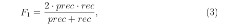
 
次のようにして精度と再現率を計算します。

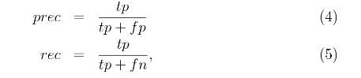

 - tpは真陽性の数です。グラウンド・トゥルースラベルは異常であり、アルゴリズムでは正しく異常と分類されています。
 - fpは偽陽性の数です：グラウンド・トゥルースラベルは異常ではなく、アルゴリズムでは誤って異常として分類されています。
 - fnは偽陰性の数です：グラウンド・トゥルースラベルは異常ですが、アルゴリズムでは異常ではないと誤って分類しています。
 
提供した`selectThreshold.m`のコードには、すでにεの多くの異なる値を試し、F1スコアに基づいて最適なεを選択するループがあります。
ここで、`selectThreshold.m`のコードを完成する必要があります。
forループを使用して、すべてのクロス・バリデーションのサンプル（tp、fp、fnの値を計算する）を使用して、F1スコアの計算を実装できます。
約8.99e-05のイプシロンの値が表示されます。

----

**実装上の注意：**


tp、fp、fnを計算するために、すべてのサンプルをループするのではなく、ベクトル化された実装を使用できます。
これは、ベクトルと単一の数値の間のOctave/MATLABの同等性テストによって実装できます。
n次元バイナリーベクトルv∈{0,1}nに複数のバイナリー値がある場合、sum(v == 0)を使用すると、このベクトルの値の数が0であることが分かります。
また、そのようなバイナリーベクトルに論理演算子を適用することもできます。
たとえば、cvPredictionsをクロス・バリデーション・セットのサイズのバイナリーベクトルとします。
ここで、i番目の要素は、アルゴリズムがcvを異常とみなす場合は1であり、そうでない場合は0です。
たとえば、以下を使用して偽陽性の数を計算することができます。

fp = sum((cvPredictions == 1) & (yval  ==  0))
 
----

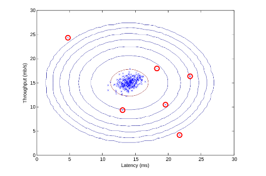

&nbsp;&ensp;&nbsp;&ensp; 図3：分類された異常

`selectThreshold.m`のコードを完成すると、`ex8.m`の次のステップで異常検出コードが実行され、プロット内の異常を丸で囲みます（図3）。

*ここで解答を提出する必要があります。*

### 1.4. 高次元データセット

スクリプト`ex8.m`の最後のパートは、より現実的ではるかに難しいデータセットで実装した異常検出アルゴリズムを実行します。
このデータセットでは、各サンプルが11のフィーチャーで記述され、コンピューティングサーバーの多くのプロパティーを取得します。

このスクリプトでは、実装したコードを使用してガウスパラメーター（μiとσi^2）を推定し、ガウスパラメーターを推定したトレーニング・データXの両方の確率を評価し、クロス・バリデーション・セットXvalの確率を評価します。
最後に、selectThresholdを使用して最高の閾値εを探します。
約1.38e-18のイプシロン値と117の異常が見つかるはずです。

## 2. レコメンダー・システム

この演習では、協調フィルタリングの学習アルゴリズムを実装し、映画の評価のデータセットに適用します。
このデータセットは、1〜5の尺度による評価から構成されます（※2）。
データセットは、nu = 943のユーザーとnm = 1682の映画です。
演習のこのパートでは、スクリプト`ex8_cofi.m`を使用して作業します。

この演習の次のパートでは、協調フィルタリングの目的関数と勾配を計算する関数`cofiCostFunc.m`を実装します。
コスト関数と勾配を実装した後、`fmincg.m`を使用して協調フィルタリングのパラメーターを学習します。

※2：GroupLens Researchからの[MovieLens 100k Dataset](www.grouplens.org/node/73/)です。

### 2.1. 映画評価のデータセット

スクリプト`ex8_cofi.m`の最初のパートは、データセット`ex8_movies.mat`をロードし、Octave/MATLAB環境に変数YとRを提供します。

行列Y（映画の数×ユーザー数の行列）は、1から5までの映画の格付けy(i, j)を格納します。
行列Rは、ユーザーjが映画iに格付けを与えた場合にはR(i, j)= 1であり、そうでない場合にはR(i, j)= 0である2値の指標行列です。
協調フィルタリングの目的は、ユーザーがまだ評価していない映画、すなわちR(i, j)= 0の映画の評価を予測することです。
これにより、予測される評価が最も高い映画をユーザーに推奨することができます。

行列Yを理解するために、スクリプト`ex8_cofi.m`は、最初の映画（Toy Story）の評価の平均を計算し、それを画面に出力します。

この演習のこのパートでは、行列X、Thetaを使って作業することになります。

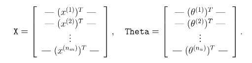

Xのi行目はi番目の映画のフィーチャー・ベクトルに対応し、Thetaの番目の行は1つの（番目のユーザーの）パラメータベクトルθ(j)に対応します。
とθ(j)はともにn次元ベクトルです。
この演習では、n = 100を使用するため、x(i) ∈ R100とθ(j) ∈ R100を使用します。
それに対応して、Xはnm×100のマトリックスであり、シータはnu×100のマトリックスです。

### 2.2. 協調フィルタリングの学習アルゴリズム

ここから、協調フィルタリングの学習アルゴリズムの実装が開始します。
コスト関数（正則化なし）を実装することから始めます。

映画推薦の設定における協調フィルタリングアルゴリズムは、n次元パラメータベクトルx(1),...,x(nm)およびθ(1),...,θ(nu)です。
ここで、モデルはユーザーjによる映画iの評価をy(i,j) = (θ(j))T x(i)として予測します。
いくつかの映画でいくつかのユーザーによって生成された評価のセットからなるデータセットが与えられた場合、最適なフィットとなる（2乗誤差を最小限に抑える）パラメータベクトルx(1),...,x(nm)、θ(1),...,θ(nu) を学習することが目的です。

`cofiCostFunc.m`のコードを完成させて、協調フィルタリングのコスト関数と勾配を計算します。
関数のパラメーター（つまり、学習しようとしている値）はXとThetaです。
`fmincg`のような市販のミニマイザーを使用するために、パラメーターを単一のベクトルパラメーターにアンロールするようにコスト関数が設定されています。
以前は、ニューラル・ネットワークのプログラミング演習で同じベクトル・アンローリングの方法を使用していました。

#### 2.2.1. 協調フィルタリングのコスト関数

協調フィルタリングのコスト関数（正則化なし）は、以下で与えられます。

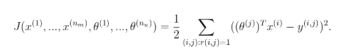

変数Jでこのコストを返すように、`cofiCostFunc.m`を変更する必要があります。
R(i, j) = 1の場合にのみ、ユーザーjと映画iのコストを累積する必要があります。
関数を完了すると、スクリプト`ex8_cofi.m`によってコスト関数が実行されます。
`22.22`が出力されるはずです。

*ここで解答を提出する必要があります。*

----

**実装上の注意：**

後で最適化パッケージ`fmincg`によって何度も呼び出されるため、ベクトル化された実装を使用してJを計算することを強くお勧めします。
いつものように、（正しい答えが得られることを確認するため）最初にベクトル化されていない実装を書いて、ベクトル化された実装に変更する方が簡単かもしれません（ベクトル化のステップがアルゴリズムの出力を変更しないことを確認してください）。
ベクトル化された実装を考え出すには、次のヒントを参考にしてください。
R行列を使用して、選択したエントリーを0に設定できます。
たとえば、`R .* M`は`M`と`R`の間で要素ごとの乗算を行います。
Rは0または1のいずれかの値を持つ要素しか持たないので、`R`の対応する値が0の場合にのみ`M`の要素を0に設定するという効果があります。
したがって、`sum(sum(R.*M))`は、`R`の対応する要素が1に等しい`M`のすべての要素の合計です。

----

#### 2.2.2. 協調フィルタリングの勾配

ここで、（正規化なしで）勾配を実装する必要があります。
具体的には、`cofiCostFunc.m`のコードを完成させ、X_gradとTheta_gradの変数を返します。
X_gradはXと同じ大きさの行列でなければならず、同様にTheta_gradはThetaと同じ大きさの行列です。
コスト関数の勾配は、以下で与えられます。

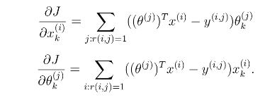

この関数は、両方の変数セットを1つのベクトルにアンロールすることによって、両方の変数セットの勾配を返します。
勾配を計算するコードを完成させた後、スクリプト`ex8_cofi.m`は勾配チェック（checkCostFunction）を実行し、勾配の実装を数値で確認します（※3）。
実装が正しい場合は、分析と数値の勾配が密接に一致することが分かります。

*ここで解答を提出する必要があります。*

※3：これは、ニューラルネットワークの演習で使用した数値チェックに似ています。

----

**実装上の注意：**

ベクトル化された実装を使用せずにこの課題の全面的な評価を得ることができますが、コードははるかに遅く（数時間）実行されるため、実装をベクトル化することをお勧めします。

まず、映画のforループ（∂J/∂x(i)kを計算する）とfor-loop overユーザー（∂J/∂θ(j)kを計算する）を使って勾配を実装できます。
最初に勾配を実装するときは、集計の各要素を計算する別の内部for-loopを実装することで、ベクトル化されていないバージョンから開始することができます。
このように勾配計算を完了したら、インプリメンテーションをベクトル化して（for-loopの内側をベクトル化する）、forループを2つだけ残すようにする必要があります（1つはループで∂J/∂x(i)k各映画についてk、ユーザーごとに∂J/∂θ(j)kを計算するためにユーザーをループするためのものです）。

----

----

**実装のヒント：**

ベクトル化を実行するには、次の情報が役立ちます。
x(i)1、x(i)2、...、x(i)nに関連するすべての導関数（すなわち、フィーチャー・ベクトルに関連する導関数）を同時に計算する方法を考え出すべきです。
i番目の映画のフィーチャー・ベクトルの導関数を次のように定義します。

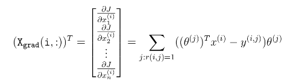

上記の式をベクトル化するには、ThetaとYにインデックスを付けて、関心のある要素(つまりr(i、j)= 1の要素)のみを選択します。
直感的に、i番目の映画のフィーチャーを検討するときは、映画に評価を与えたユーザーの関心だけが必要です。
これにより、他のすべてのユーザーをThetaとYから取り除くことができます。

具体的には、idx = find(R(i、：)== 1)を映画iを評価したすべてのユーザーのリストに設定できます。
これにより、Theatatemp = Theta(idx、:)とYtemp = Y(i、idx)を作成して、ThetaとYにインデックスを付けて、i番目の映画を評価したユーザーの集合のみを与えることができます。
これにより、以下のように導関数を書くことができます：

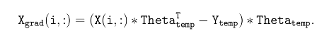

(注：上記のベクトル化された計算は、代わりに行ベクトルを返します。)

に関して微分の計算をベクトル化した後、同様の方法を使って微分をθ(j)に関してもベクトル化する必要があります。

----

#### 2.2.3. 正則化コスト関数

正則化を伴う協調フィルタリングのコスト関数は、以下の通りです。
 
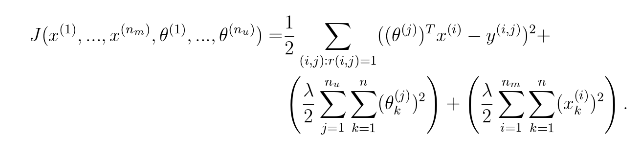

ここで、コスト関数Jの元の計算に正規化を追加する必要があります。
完成後、スクリプト`ex8_cofi.m`は正則化されたコスト関数を実行すると、約31.34のコストとなるはずです。

*ここで解答を提出する必要があります。*

#### 2.2.4. 正則化された勾配

正則化されたコスト関数を実装したので、勾配の正則化を実装する必要があります。
正則化項からの寄与を加えることによって正則化された勾配を戻すように、`cofiCostFunc.m`の実装に追加する必要があります。
正則化されたコスト関数の勾配は、以下で与えられることに注意してください。

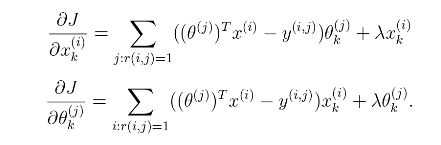

これは先ほど説明した変数X_grad(i,:)にλx(i)を加え、前述のTheta_grad(j,:)変数にλθ(j)を加えるだけでよいことを意味します。
勾配を計算するためのコードを完成すると、スクリプト`ex8_cofi.m`は勾配の実装を数値で確認するために別の勾配チェック（checkCostFunction）を実行します。

*ここで解答を提出する必要があります。*

### 2.3. 映画のお勧めを学ぶ

協調フィルタリングのコスト関数と勾配の実装が完了したら、アルゴリズムのトレーニングを開始して映画のおすすめを自分で作成できます。
ex8＿cofi.mスクリプトの次のパートでは、独自の映画設定を入力することができます。
その結果、アルゴリズムが実行された後で、自分の映画のお勧めを得ることができます。
私たちは自分の好みに応じていくつかの値を記入しましたが、あなたの好みに応じてこれを変更する必要があります。
データセット内のすべての映画のリストとその番号は、ファイルmovie_idx.txtにリストされています。

#### 2.3.1. お勧め

```
Top recommendations for you:
Predicting rating 9.0 for movie Titanic (1997)
Predicting rating 8.9 for movie Star Wars (1977)
Predicting rating 8.8 for movie Shawshank Redemption, The (1994)
Predicting rating 8.5 for movie As Good As It Gets (1997)
Predicting rating 8.5 for movie Good Will Hunting (1997)
Predicting rating 8.5 for movie Usual Suspects, The (1995)
Predicting rating 8.5 for movie Schindler's List (1993)
Predicting rating 8.4 for movie Raiders of the Lost Ark (1981)
Predicting rating 8.4 for movie Empire Strikes Back, The (1980)
Predicting rating 8.4 for movie Braveheart (1995)
Original ratings provided:
Rated 4 for Toy Story (1995)
Rated 3 for Twelve Monkeys (1995)
Rated 5 for Usual Suspects, The (1995)
Rated 4 for Outbreak (1995)
Rated 5 for Shawshank Redemption, The (1994)
Rated 3 for While You Were Sleeping (1995)
Rated 5 for Forrest Gump (1994)
Rated 2 for Silence of the Lambs, The (1991)
Rated 4 for Alien (1979)
Rated 5 for Die Hard 2 (1990)
Rated 5 for Sphere (1998)
```

&nbsp;&ensp;&nbsp;&ensp; 図4：映画のお勧め

追加の評価がデータセットに追加されると、スクリプトは協調フィルタリングのモデルをトレーニングします。
これにより、パラメータXとThetaを学習します。
ユーザーjの映画iの評価を予測するには、(θ(j))T x(i)を計算する必要があります。
スクリプトの次のパートでは、すべての映画とユーザーの評価が計算され、スクリプトで先に入力された評価に従って、推奨する映画が表示されます（図4）。
ランダムな初期化が異なるため、異なる予測セットが得られる可能性があることに注意してください。

## 提出と採点

この課題が完了したら、送信機能を使用して解答を我々のサーバーに送信してください。
以下は、この演習の各パートの得点の内訳です。

| パート | 提出するファイル | 点数　|
----|----|---- 
| ガウス分布のパラメーターの推定 | `estimateGaussian.m` | 15 点 |
| 閾値の選択 | `selectThreshold.m` | 15 点 |
| 協調フィルタリングのコスト | `cofiCostFunc.m` | 20 点 |
| 協調フィルタリングの勾配 | `cofiCostFunc.m` | 30 点 |
| 正規化されたコスト | `cofiCostFunc.m` | 10 点 |
| 正則化された勾配 | `cofiCostFunc.m` | 10 点 |
| 合計点 |  | 100 点 |

解答を複数回提出することは許可されており、最高のスコアのみを考慮に入れます。
